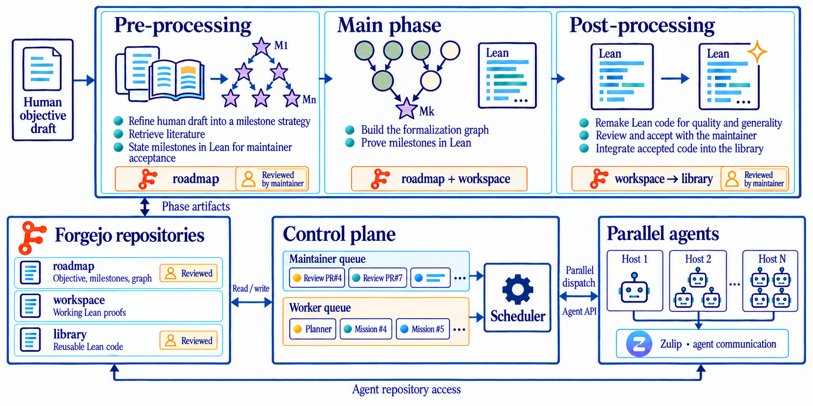
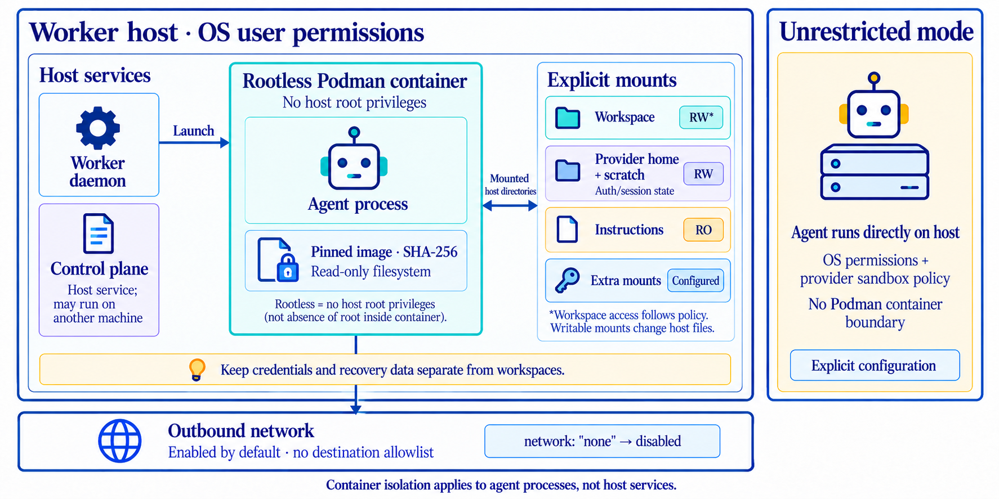
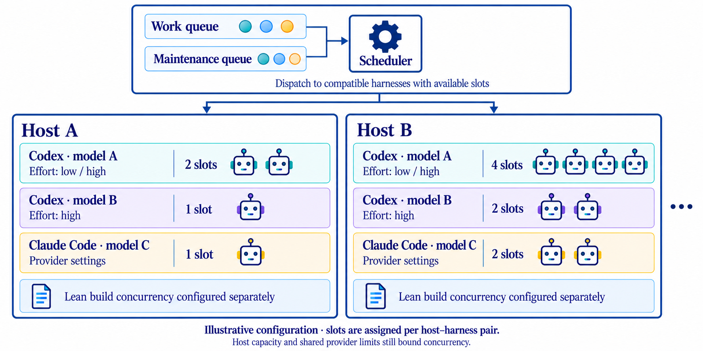

# Archon Horizon


[](https://arxiv.org/html/2610.08329v1)

> [!WARNING]
> Archon Horizon v0.2.0 is **alpha software** and substantially changes the
> architecture from [v0.1.5](https://github.com/frenzymath/Archon-Horizon/tree/5d603f8ee7d66de81eff2863cbb6f29b4440712a).
> Use v0.2.0 for new projects only; keep existing projects on their current version.

Archon Horizon coordinates automatic Lean formalization across projects and worker
machines. Auto-formalization using Archon Horizon can be fully automatic, but integrates several ways for humans to interact with the system as well. Missions form a tree of scoped outcomes with explicit acceptance
criteria. One PostgreSQL control plane schedules their assignments, preserves
provider context, records progress, and reliably publishes work to Forge. Agents can coordinate through a Zulip instance and a Forge instance, where human can directly participate as well. The dashboard
brings together roadmaps, graphs, missions, Activity, Forgejo, and Zulip.

<div align="center" style="text-align: center;">
  
  <p><em>Archon Horizon: from a human objective to a reusable Lean library, coordinated through separate work and maintenance queues.</em></p>
</div>

Archon Horizon has been used to coordinate development of the
[FrenzyMath Poincaré Conjecture formalization](https://github.com/frenzymath/Poincare-Conjecture)
([paper](https://arxiv.org/html/2610.08329v1)).

## Installation

Use Python 3.11 or newer. Release wheels include the dashboard. To install
from a source checkout, also use Node.js 20 and npm:

```sh
git clone https://github.com/frenzymath/Archon-Horizon.git
cd Archon-Horizon
python3 -m venv .venv
. .venv/bin/activate
npm --prefix src/archon_horizon/frontend ci
npm --prefix src/archon_horizon/frontend run build
python -m pip install '.[control-plane]'
```

Workers install `[pipeline-worker]`. Add `[search]` where Lean indexing is used;
use `[dev]` for development. Configure PostgreSQL and explicit installation paths
as described in the [setup guide](docs/pipeline-setup.md).

Configuration depends on your machine, provider accounts, isolation requirements,
and project. Because it might be difficult to configure, we recommend preparing it with your coding agent using the setup guide and [configuration examples](deploy/pipeline), then reviewing the generated installation plan before applying it. It can be modified at any time.

During setup, you choose where Horizon stores its data and project workspaces.
Agents can modify host files shared with their containers. The control plane and
worker daemon run with their OS account’s permissions; storage settings do not
restrict all host filesystem access. Database, container and tool caches may use
additional directories.

## Security And Sandbox

By default, **agent processes run inside rootless Podman containers**; the worker
daemon itself runs on the host. “Rootless” means Podman runs without host root
privileges. Agents see the container filesystem and explicitly mounted host
directories: the selected workspace, a dedicated provider home for authentication
and session state, disk-backed scratch, read-only instructions and configured
extra mounts. Writes through writable mounts modify the corresponding host files.

<div align="center" style="text-align: center;">
  
  <p><em>Archon Horizon: security and sandboxing</em></p>
</div>


The image is pinned by its SHA-256 digest, identifying its exact contents. Its
filesystem is read-only; writable mounts remain writable. Outbound networking
is enabled by default without a destination allowlist; `"network": "none"`
disables it.

The **control plane runs as a host service** under its OS user’s permissions;
the worker sandbox does not isolate it. Explicit `unrestricted` worker mode runs
agent processes directly on the host, subject to OS permissions and the provider’s
own sandbox policy.

You choose where Horizon keeps project workspaces, agent state and build caches.
Keep credentials and recovery data separate from agent workspaces. See the
[setup guide](docs/pipeline-setup.md) for storage and sandbox configuration,
including [cleanup and backups](docs/pipeline-setup.md#cleanup-and-backups).

## Parallelism And Resources

One control plane can schedule one or several worker hosts. Work and Maintenance
have separate queue policies and session limits; both share the available host
and provider capacity. Worker `slots` bounds primary execution capacity, and
native subagents use their provider’s native behavior by default, with no
Horizon-imposed cap. Operators can optionally configure a separate subagent limit.

<div align="center" style="text-align: center;">
  
  <p><em>Archon Horizon: a harness scalable to resource availability</em></p>
</div>

Compiler concurrency is independent of agent concurrency. Managed Lean builds
default to one build and one dependency preparation at a time per shared build
root. Resource observations can defer new work under memory or I/O pressure;
they do not predict each proof's peak memory use. See
[managed Lean checks](docs/pipeline-setup.md#managed-lean-checks).

## Customization

Adapt Horizon to your project through:

- **Agent guidance:** add or override Markdown skills and specialist instructions,
  and browse the installed skills and prompt templates in the dashboard.
- **Review:** choose reviewers, their instructions and the acceptance criteria for
  roadmap and library contributions.
- **Execution:** select providers, models, reasoning effort, concurrency and budgets.
- **Integrations:** connect your repositories, Forgejo and Zulip for collaboration
  with agents and other people. In particular Forgejo handles mirroring a Github repository with scheduled synchronization.

See [skills and reviewers](docs/pipeline-reviewers.md) and the
[configuration guide](docs/pipeline-setup.md) for details. Running sessions retain
their original instruction bundle.

## Running a Project

Once the control plane and workers are running, use the dashboard to create
projects and monitor work, and the CLI/API to register objectives and launch
objective runs. Your coding agent can guide you through setup and operation.

Create a **project**, connect its repositories and workers, then add one or more
**objectives**. Write each objective as a Markdown document describing the desired
outcome; a human draft is enough to begin. Choose the phase that fits your project:

- **Preprocessing:** review the literature, collect references, refine the objective
  and propose a roadmap and milestones.
- **Main formalization:** work toward the objective in the Lean workspace.
- **Postprocessing:** improve the quality, organization and reuse of existing
  formalizations, and prepare contributions to a destination library.

Each phase can run independently. You can start directly with formalization, or
use postprocessing on a Lean project developed outside Horizon. Monitor progress
through the dashboard and join discussions or give further instructions through
Zulip when useful. See the [setup guide](docs/pipeline-setup.md) for launch commands
and the inputs needed to start at each phase.

## Dashboard

The dashboard brings together objectives, the formalization graph, agent activity,
references and project integrations. Open `/pipeline` on the configured host and
port; the default local address is `http://127.0.0.1:8788/pipeline`.

For private remote access, expose the dashboard through **Tailscale Serve**.
Tailscale device sharing can also give collaborators outside your tailnet access.
They need a Horizon account and Tailscale access to the dashboard, but no OS account
or SSH access on the control-plane machine. Use Tailscale access controls to allow
only the dashboard’s HTTPS port. See [dashboard access](docs/pipeline-setup.md#dashboard-access)
for configuration and sharing instructions.

## Documentation And Demo

The [documentation index](docs/README.md) collects setup, architecture, agent
workflows, and review guidance. A GitHub Pages site and a read-only dashboard demo
can be built from this checkout; see the [site guide](docs/documentation-site.md)
and [demo guide](docs/dashboard-demo.md). The demo uses synthetic data and needs
no Horizon installation or provider account.

## License

[Apache License 2.0](LICENSE). Third-party attributions are listed in
[THIRD_PARTY_NOTICES.md](THIRD_PARTY_NOTICES.md).
