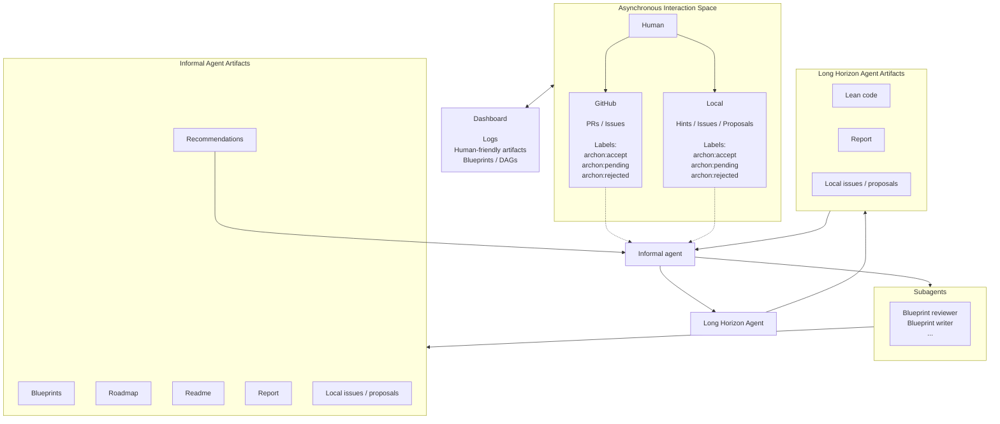

# Archon Horizon Code Roadmap

This document sketches the architecture for a fresh, more general successor to
Archon. The main goal is to keep Archon's useful ideas while making it faster, lighter, and more flexible. 

## Core Direction

The new system should have two first-class abstract agents, the concept of loop and iteration should be forgotten, because this is more like a discussion/collaboration between two agents. 

0. **Human Side**
   - Human communication should be asynchronous and structured. Use a generic
     inbox abstraction with at least two instances:
     - `local`: local hints, local issues, local proposals, and issues raised by
       agents.
     - `github`: GitHub issues, PRs, comments, and reviews, when GitHub support
       is enabled.
   - Inbox items should use a small shared label set:
     - `archon:accept`: this item is accepted as relevant input.
     - `archon:pending`: this item is waiting for human triage.
     - `archon:rejected`: this item should be kept for history but ignored by
       agents.
   - Local user hints are accepted by default unless explicitly marked pending.
     GitHub items are not accepted by default; the human or a later triage bot
     must apply `archon:accept`. 
   - The local inbox should be fully editable through CLI and dashboard:
     add hints/issues/proposals, change labels, mark complete, reject, archive,
     or delete drafts.
   - The GitHub inbox should be shown in the dashboard but not edited directly
     from the static dashboard. GitHub labels and comments should be changed
     through GitHub itself or through explicit CLI commands when `gh` is
     available.
   - Freeze should be first-class. A freeze can apply at workspace, project,
     file, declaration, blueprint node, or agent level. Frozen state means:
     agents may read and report, but cannot write without an explicit unfreeze
     or an override recorded in the event log.

1. **Informal agent**
   - Builds and maintains blueprints, but it should be human quality / not machine quality, still aiming at having a perfect dag. 
   - Produces human-readable dashboard material.
   - Owns the public roadmap. The Horizon agent may produce a private execution
     plan and may report what it intends to do next, but the informal agent is
     responsible for translating that into a human-readable roadmap, checking it
     against the blueprint/DAG/hints, and deciding what should be displayed on
     the dashboard.
   - Reads human hints, GitHub issues, comments, reports, source material, and previous runs.
   - Uses lightweight subagents and skills where work can be delegated cheaply:
     blueprint linting, DAG consistency checks, summarization, source lookup,
     dependency analysis, report generation, GitHub triage.
   - No objective, no heavy log reading. It can give recommendations to the horizon agents, or pointing out some specific issues. 
   - The prompt itself should stay light. The default context should be the
     current roadmap, accepted inbox items, blueprint/DAG summary, open
     questions, compact diffs since the previous collaboration round, and a
     small memory file. Full logs are available as artifacts, but should be
     pulled only on demand.

2. **Horizon agent**
   - Owns long-horizon formalization work.
   - Very light prompt, no heavy reading phase (i.e. no fix cost, so that each run is proportional to the time only), mostly receive a small context of the task, and just the roadmap for instance. 
   - Writes Lean, runs tools, calls build scripts, repairs failures, and manages its own local proof strategy.
   - It should not be expected
     to write polished human reports; the informal agent turns these updates
     into dashboard/GitHub material. It only writes a report at the end. 

## Workspace Ontology

The global root should be called a workspace. A project is a member
formalization unit inside or referenced by that workspace. This avoids a
project/subproject hierarchy: all projects are peers.

```text
Workspace
  A full mathematical/formalization collaboration root.
  Owns config, state, roadmap, dashboard, GitHub integration, and projects.

Project
  One concrete formalization unit inside or referenced by the workspace.
  Usually a Lean repository or Lean package, but not necessarily.
```

- It should be easy to launch multiple sessions with the same command, focussing
  on different tasks. Use a workspace-level scheduler and per-project locks:
  `archon-horizon run` lets the scheduler pick tasks, while
  `archon-horizon run <project> ...` focuses a session and
  `archon-horizon run --task <id>` pins it to one task.
  Parallel Horizon sessions are allowed when their declared write sets do not
  overlap. If the write set is unknown, the scheduler should pessimistically
  lock the whole project.
- The workspace itself should be handled by Archon Horizon. From the workspace
  root, the user should add projects with explicit commands, and the informal
  agent may propose creating, splitting, merging, or archiving projects.
  Structural changes are executed only through explicit workspace/project
  operations that record events and update config.
- Git model:
  - The workspace has its own git repository and owns `config.yaml`,
    `.archon-horizon/`, dashboards, reports, inboxes, and orchestration state.
  - Projects should be embedded directories inside the workspace. Do not use
    git submodules and do not make external paths part of the core model.
  - A project directory should not contain a real `.git/` directory. Nested git
    repositories trigger confusing parent-git behavior and should be avoided.
  - If a project needs its own VCS history, store that git directory outside the
    project tree, under `.archon-horizon/vcs/<project>.git`, and access it
    through explicit `--git-dir` / `--work-tree` wrappers. The project worktree
    remains an ordinary embedded directory from the workspace's point of view.
  - If a project was imported from an upstream git repository, record origin
    metadata in config/state, but do not keep an embedded `.git/` at the project
    root.
  - If project-level VCS is enabled, Horizon may commit there for source
    changes. The workspace records the referenced project commit SHA and run
    metadata.
  - The workspace git should not copy every project commit. It should act as a
    manifest/history of the whole workspace, similar to a lockfile for the set
    of project revisions.
  - If project-level VCS is disabled, the workspace repository owns the project
    source files directly.
- The leanblueprint library itself is troublesome. The new system should keep
  the useful blueprint conventions but own the renderer:
  - Store blueprint source in a simple local format, initially LaTeX-compatible
    enough to reuse existing text.
  - Parse only the commands/conventions Archon Horizon needs for DAG, labels,
    statements, proof sketches, source references, and Lean declaration links.
  - Render with the dashboard's KaTeX renderer.
  - Generate DAG JSON directly from the parsed blueprint instead of depending
    on `leanblueprint web` as a build step.

## High-Level Architecture

Current target diagram:



```text
Human / GitHub / Dashboard
          | Asynchronously
          v
    Informal Agent
          |
          | structured tasks, roadmap context, accepted inbox items
          v
     Horizon Agent
          |
          | compact updates, artifacts, blockers, questions
          v
    Informal Agent

As many rounds as specified in the config.
```

Operationally, one collaboration round should be:

```text
1. Sync inbox providers.
2. Informal agent triages accepted inbox items, updates memory/blueprint/roadmap/reports.
3. Scheduler selects Horizon tasks.
4. Horizon agent runs one or more tasks autonomously.
5. Build/tool results are captured as artifacts and events.
6. Informal agent converts compact Horizon updates into human-facing state and
   local issues/proposals.
7. Dashboard/GitHub are refreshed.
```

This can happen once, for `workspace.rounds`, or continuously until the task
queue is empty, budget is exhausted, or a freeze/blocker stops progress.

## Notification and Sync Policy

Hints, GitHub updates, and human messages should not be injected into a running
agent. They are written immediately to their inbox provider, but agents only
observe accepted items at explicit sync boundaries. This keeps runs reproducible
and avoids changing a long Horizon attempt halfway through.

Sync boundaries:

```text
1. Before the informal agent starts.
2. After the informal agent finishes.
3. Before the Horizon agent starts.
4. After the Horizon agent finishes.
5. After a build failure or blocked task.
6. Before dashboard/GitHub publishing.
```

Default behavior:

```text
human/GitHub adds hint
  -> inbox entry is created
  -> running agent continues unchanged
  -> next sync boundary reads accepted inbox entries
  -> accepted item affects the next agent context
```

There should be no live prompt injection. This is not a configurable behavior:
the orchestration code should run deterministic sync steps between agents and
after important tool outcomes. Urgent messages can mark future scheduling state
as paused or frozen, but they should not alter the context of an already running
agent.

## CLI Invocation Model

The main command should be:

```bash
archon-horizon run
```

With no project arguments, this runs at workspace level. The informal agent sees
the whole workspace roadmap, all accepted inbox items, all projects, cross-project
dependencies, and can decide what to recommend or schedule. It may raise local
proposals such as creating a new project, splitting a project, or merging two
projects, but structural workspace changes should still go through explicit
proposal acceptance/execution.

Focused runs should use project arguments:

```bash
archon-horizon run ag-main topology-base
```

This does not create a separate workspace and does not rewrite the roadmap into
a smaller roadmap. It creates a focused run over the same workspace:

- agents receive a sliced context centered on the listed projects;
- the dashboard/session is marked with `focus.projects`;
- the scheduler only starts Horizon tasks that write to focused projects;
- read-only context may still include outside projects when they are direct
  dependencies or blockers;
- agents may propose work outside the focus, but should not execute it during
  that focused run.

Use explicit flags for narrower targets:

```bash
archon-horizon run --task T-0007
archon-horizon run --proposal P-0003
archon-horizon run ag-main --rounds 1
```

Tasks and proposals are runtime state, not config. `config.yaml` should contain
stable workspace/project settings only: projects, harnesses, GitHub settings,
default round count, scheduler policy, etc. Concrete work items live under
`.archon-horizon/`:

```text
.archon-horizon/
  tasks/
    T-0007.yaml
  proposals/
    P-0003.yaml
```

The informal agent, local inbox, dashboard, or CLI may create tasks/proposals.
The config should not grow every time the system discovers a new thing to do.

Suggested command shape:

```text
archon-horizon run [PROJECT ...]
  --task <task-id>          run or resume a specific task
  --proposal <proposal-id>  run from an accepted proposal
  --rounds <n>              override workspace.rounds for this invocation
  --dry-run                 build context and plan, but do not run Horizon
```

Run records should preserve the focus:

```yaml
id: S-0001
kind: run
focus:
  projects:
    - ag-main
    - topology-base
  task: null
  proposal: null
rounds_requested: 5
created_at: "2026-06-19T00:00:00Z"
```

## Roadmap Format

The roadmap should have a structured source of truth, with Markdown generated
from it for humans and the dashboard.

Canonical files:

```text
.archon-horizon/roadmap.yaml
.archon-horizon/reports/roadmap.md
```

`roadmap.yaml` should be used for filtering, validation, scheduling, and
cross-project queries. `roadmap.md` is a rendered artifact.

Minimal shape:

```yaml
version: 1
updated_at: "2026-06-19T00:00:00Z"
items:
  - id: R-0001
    title: "Repair affine cover lemmas"
    status: active        # active | pending | blocked | done | rejected
    projects:
      - ag-main
    depends_on: []
    kind: proof           # proof | blueprint | refactor | workspace | report
    priority: high
    summary: "Needed before continuing the scheme gluing chapter."
    inbox_refs:
      - I-0001
    task_refs:
      - T-0007
```

Focused runs should pass a roadmap slice into agent context, not a separate
roadmap file. A slice includes:

- roadmap items whose `projects` intersect the focus;
- direct dependency items;
- direct blockers from other projects;
- relevant accepted inbox items;
- memory bullets and reports relevant to the focus.

## Configuration Direction

Use human-managed YAML as the main config format.

Suggested files:

```text
.archon-horizon/ 
  events.jsonl
  memory.md
  logs/
  prompts/
  reports/
  tasks/
  artifacts/
  locks/
  inboxes/
  shared/
folderA/ 
  config.yaml (optional, project config)
  projecta/ 
    config.yaml (optional, nested project config)
  projectb/ 
    config.yaml (optional, nested project config)
  ...
folderB/
projectA'/
  ... 
config.yaml
```

Example shape:

```yaml
workspace:
  name: algebraic-geometry-horizon
  state_dir: .archon-horizon
  rounds: 5
  informal_agent: 
    harness: lightweight-default
  horizon_agent:
    harness: horizon-default
  scheduler:
    max_parallel_sessions: 4
    unknown_write_set_policy: lock-project
  git:
    mode: manifest
    auto_commit_state: true

harnesses:
  horizon-default:
    kind: external-agent
    command: horizon-agent
    model: fable5
    options:
      effort: high

  lightweight-default:
    kind: codex
    model: default
    options:
      effort: medium

github:
  enabled: false
  repo: owner/repo
  import_policy: labeled-only
  labels:
    accept: archon:accept
    pending: archon:pending
    rejected: archon:rejected

projects:
  ag-main:
    path: projects/ag-main
    type: lean
    vcs:
      enabled: true
      git_dir: .archon-horizon/vcs/ag-main.git
      origin: https://github.com/example/LeanAlgebraicGeometry.git
      branch: main
    blueprint:
      path: projects/ag-main/blueprint
      renderer: archon-katex
    build:
      command: lake build
    freeze:
      files: []
      declarations: []
```

## State and Communication Files

Initial state layout:

```text
.archon-horizon/
  events.jsonl
  memory.md
  inboxes/
    local.yaml
    github-shadow.yaml
  manifest.yaml
  tasks/
    T-0001.yaml
  proposals/
    P-0001.yaml
  artifacts/
  reports/
  blueprints/
  locks/
```

## Inbox Provider Model

The dashboard and agents should talk to inboxes through an abstract provider
interface. Local files and GitHub are just two implementations.

First-pass interface:

```python
class InboxProvider:
    name: str
    capabilities: set[str]  # read, create, edit, delete, label, comment, sync

    def list_items(self, filters: "InboxFilter") -> list["InboxItem"]: ...
    def get_item(self, item_id: str) -> "InboxItem": ...
    def create_item(self, item: "InboxDraft") -> "InboxItem": ...
    def update_labels(self, item_id: str, labels: list[str]) -> None: ...
    def update_status(self, item_id: str, status: str) -> None: ...
    def add_comment(self, item_id: str, body: str) -> None: ...
    def sync(self) -> "SyncResult": ...
```

Provider rules:

- `local` supports read/create/edit/delete/label/comment and is safe for the
  live local dashboard to edit.
- `github` supports read/sync and may support explicit CLI-backed label/comment
  operations, but the static dashboard should treat it as read-only.
- Agents may create local issues/proposals, but they should not directly edit
  GitHub unless an explicit publishing command or policy allows it.

Dashboard rules:

- Live local dashboard: can edit the `local` inbox, including adding hints,
  adding issues/proposals, changing labels, completing items, rejecting items,
  archiving items, and deleting drafts.
- Static GitHub Pages dashboard: should show the local and GitHub inbox shadows,
  reports, blueprints, DAGs, logs, and memory, but should not persist edits.
  If edit controls are shown, they should be disabled or clearly point the user
  to the CLI/GitHub workflow.
- GitHub inbox entries are never edited implicitly by dashboard state. GitHub
  changes happen in GitHub or through explicit `gh`-backed commands.

Minimal inbox item:

```yaml
id: I-0001
provider: local        # local | github
source_ref: null       # e.g. issue:42#comment-1 for GitHub shadow items
status: open           # open | completed | archived
labels:
  - archon:accept      # archon:accept | archon:pending | archon:rejected
scope:
  project: ag-main
  file: null
  declaration: null
kind: hint             # hint | issue | question | blocker | review | proposal
body: "Try proving the affine case first."
created_at: "2026-06-19T00:00:00Z"
updated_at: "2026-06-19T00:00:00Z"
```

Minimal task entry:

```yaml
id: T-0001
status: queued         # queued | running | blocked | done | failed | cancelled
agent: horizon
project: ag-main
objective: "Repair the build failure in AlgebraicGeometry/Foo.lean."
context_refs:
  roadmap: reports/roadmap.md
  hints:
    - I-0001
write_set:
  files:
    - AlgebraicGeometry/Foo.lean
locks:
  mode: files          # files | project | workspace
```

## Local Issues and Proposals

Agents should use the local inbox to raise issues and proposals for the human
and the informal agent. Examples:

- "We might create a new project for the shared topology lemmas."
- "We might merge projects `ag-main` and `ag-examples`."
- "The current blueprint node appears to state a false theorem."
- "This declaration should be generalized before more projects depend on it."

These are not tasks by default. They are inbox items with `kind: proposal` or
`kind: issue`, usually labeled `archon:pending` when human approval is needed.
Once accepted, the informal agent may turn them into roadmap edits, workspace
operations, or Horizon tasks.

## Memory File

Keep a tiny durable memory file for cross-round lessons that should not be
rediscovered repeatedly. This should be human-readable and intentionally small:
about 10 bullets, edited by the informal agent and visible in the dashboard.

Path:

```text
.archon-horizon/memory.md
```

Rules:

- Store only stable, high-value reminders.
- Prefer facts that prevent repeated mistakes.
- Do not use it as a log or scratchpad.
- When adding a new bullet beyond the limit, merge or remove an older one.

Example:

```markdown
# Memory

- Do not try to prove `Foo.bar` before `Foo.baz`; the dependency is real.
- The affine case should be handled in the separate `ag-affine` project.
- The blueprint uses `Spec` notation differently from mathlib in chapter 2.
```
