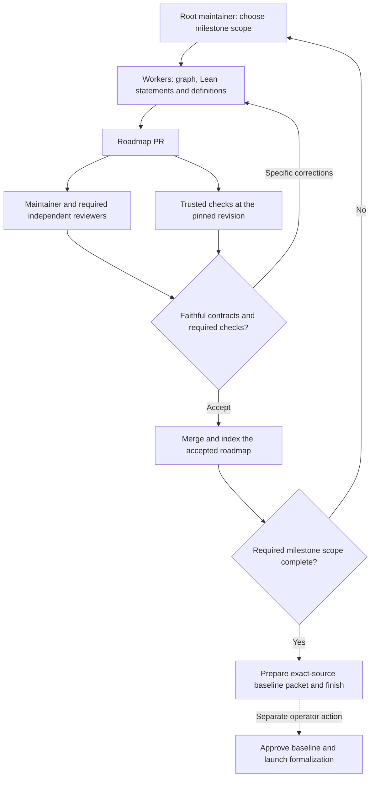
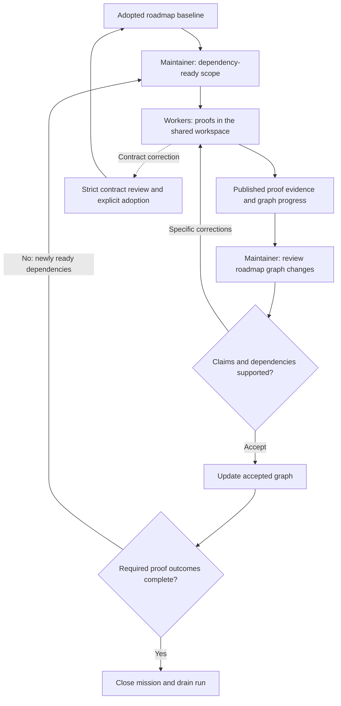
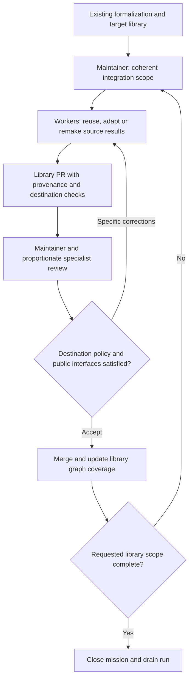

# Architecture

Horizon has one control plane in `src/archon_horizon/pipeline`. The `horizon` and
`horizon-pipeline` commands invoke its CLI. The API serves `/api/v3` and the React
dashboard at `/pipeline`.

## Durable State

PostgreSQL stores projects, missions, runs, assignments, execution leases,
obligations, catalog revisions, and delivery state. SQLAlchemy Core manages
bounded connections and transactions; Alembic maintains the current schema.
Only an explicit operator command applies schema migrations. Immutable artifacts
hold larger evidence, provider data and pinned instruction bundles.

Missions form an ownership tree. Each child records its acceptance criteria,
delegation purpose and structured scope within its parent. Creating or moving a
child checks the parent revision and open-child budget in the same transaction.
Agent credentials confine mission mutations to the current assignment's subtree.
The mathematical dependency DAG is separate: a dependency is required evidence,
not ownership or a request to launch another agent.

Assignments retain the durable work and obligation ledger for one scoped role;
executions are leased attempts on those assignments. The runnable queue is a
projection of mission state, assignment order and conditions, run limits, leases
and physical capacity. It is not another mutable task list. Agents can adjust
permitted queued work through revision-checked commands, while the scheduler owns
admission and resource claims. Narrow contexts aid mathematical decisions; server
invariants prevent stale updates, cycles and unbounded delegation.

## Work And Maintenance

New default runs start with one root maintainer. It chooses ready work, delegates
independent tasks, reviews results, arranges repairs and closes the phase.
Planning is an activity, not a required separate agent profile. Workers can
delegate narrower work and use native helpers while retaining an integration
owner. Parallel child maintainers are useful for independent review scopes.

The root maintainer is event-driven. It can checkpoint on a result and release
execution capacity. The scheduler admits ready owners and wakes maintenance for
changed work or a concrete recovery need; free slots alone are not a request for
another coordination session. The default path does not use the separate planner
refill, recurring orchestrator or legacy coordination-recovery admission loops.
See [recovery](coordination-recovery.md) for deduplication and failure behavior.

Existing configured automations remain supported. Explicit `orchestrated: true`
runs retain their previous supervisor/planner/maintainer path; source updates do
not rewrite live run configuration or retained instruction bundles. This is
compatibility for existing deployments, not the recommended new-run workflow.

The normal agent prompt carries the task, phase outcome and its open commitments.
Supporting skills and helper descriptions are discovered on demand. Prepared
reviewers receive their pinned packet and lifecycle without the generic work,
planning and coordination startup. Reviewer invocation follows each configured
descriptor: native children are collected by their parent; durable assignments
own their review independently.

### Operational Diagnosis

Any live worker or maintainer can read `agent context --view operations`.
It supplies bounded run activity, owners, admission reasons, exact-head review
blockers, trusted-job state and sanitized host health, with authorized dashboard
and record drilldowns. Shared capacity is aggregate; another project's records
and host administration credentials are not exposed.

A concrete anomaly can justify the native `orchestration-auditor` helper. It
returns observations, a diagnosis, proposed repair, responsible owner and the
evidence that would confirm recovery. The parent applies authorized changes.
The helper does not run builds, change queues or act as a permanent monitor.
Its read-only task is an instruction, not a separate authorization boundary.

A mission tree helps divide context and responsibility, but does not guarantee
that independently chosen interfaces fit together. The graph records cross-branch
dependencies; an integration owner and review provide the necessary global check.
Awareness of other sessions is available when it affects a decision, not an
obligation for every worker to monitor the whole run.

Pending operator instructions and delivery failures remain explicit notices.
The CLI surfaces bounded notices at API boundaries; reading is not disposition.
Lease loss and stop requests are enforced by the host independently of model
attention. This infrastructure remains necessary even with simpler agent roles.

## Phase Workflows

Each phase uses the same worker, review and repair loop. The accepted artifact
changes by phase. An operational audit is available from any step when a concrete
anomaly appears; it is not a mandatory stage.

### Preprocessing

The route is reviewed before contract acceptance. Contracts include the definitions
needed to interpret the statements; compiling a weakened or circular statement
does not establish quality. Preprocessing ends with its ready packet, not after
the theorem proofs or while waiting indefinitely for human approval.

### Main Formalization

The workspace is free working space. There is no routine workspace-proof PR
acceptance stage; the reviewed repository is the roadmap. Conditional proofs
remain conditional until their admitted prerequisites are discharged.

### Postprocessing

Reuse sound proofs and matching verification evidence. A separate admitted
statement skeleton is optional when the interface needs agreement; it is not a
prerequisite for porting an already sound result. Reviews emphasize faithful
meaning, useful definitions and compatibility with the destination library.

## Tradeoffs And Validation

| Choice | Benefit | Remaining responsibility or risk |
| --- | --- | --- |
| One root maintainer entrypoint | One owner for the next decision and phase closure | Large runs need disjoint child maintenance scopes to avoid a bottleneck |
| On-demand native audit | Ordinary work avoids continuous supervision overhead | With no live parent, host recovery must make maintenance runnable |
| Narrow mission tree | Smaller contexts and explicit responsibility | Shared interfaces and cross-branch graph dependencies still require integration judgment |
| Short role instructions and focused skills | Fewer contradictory obligations and repeated startup calls | Useful API examples and exact reviewer packets must remain discoverable |
| Durable receipts and obligations | Interrupted work retains evidence and an owner | Some explicit settlement calls remain; final prose alone cannot safely replace them |

Runtime tests establish particular properties: one outstanding owner, no repeated
wake on unchanged evidence, event waits surviving checkpoints, recoverable failures
retaining context, and strict review gates remaining in force. An offline agent
walkthrough checks whether the instructions lead to the intended phase decisions.
Neither establishes mathematical judgment or a wall-clock completion guarantee.

A fresh Luna benchmark should measure time to the accepted phase artifact, review
rounds per changed head, time spent producing or reviewing evidence, and idle time
without a justified producer. Success means faithful reviewed contracts and clean
closure, not more sessions, a larger queue or an apparently busy dashboard.

## Workers And Integrations

Each worker maintains a local durable journal. Assignment leases fence stale
execution; provider thread state supports continuation. Git checkpoints and API
intents survive transport failures for reconciliation and retry. Local Lean build
slots, exact-source cache keys, and resource deadlines bound compilation work.
Definitive validation rejections with no possible applied effect become retained
diagnostics. Conflicts and uncertain network outcomes remain unresolved until
reconciled. The host fingerprints the actual unresolved journal entries across
executions; resolving a server-side wrapper does not reset that failure budget.
One stable journal obligation is reopened as needed, and unchanged unresolved
intents eventually fail the assignment with a repairable diagnostic instead of
creating an endless sequence of fresh blockers.
Unfinished retained sessions reserve their worktree even while checkpointed.
Capable workers provision separate worktrees from pinned local Git objects when
the reusable pool is exhausted, acknowledging preparation before provider launch.
Persistent roadmap checkouts are prepared separately and verified with
`verify-workspaces` before trusted milestone verification can use them. A
`preparing` database record alone neither clones a repository nor makes a local
checkout available. Cleanup must preserve registered live workspaces, or update
their availability before later admission.
Planning can reconsider unused admissible capacity while other sessions run,
without creating a second planner or bypassing task dependencies.

Integration credentials stay with their configured owner. Server connectors
deliver Forge and Zulip operations using durable identities and idempotency
markers. Review descriptors specify a perspective; worker/maintainer roles and
repository policy determine authority. Specialist approval alone cannot grant
permission to merge.

The dashboard uses authenticated read models, bounded pages, cached queries and
event invalidation. Run phase and execution status are separate facts. Search
indexes and local reference caches are rebuildable projections, not the source
of project truth.

See [setup](pipeline-setup.md) for deployment and recovery procedures, and
[the design specification](design/pipeline.md) for the intended domain model.
