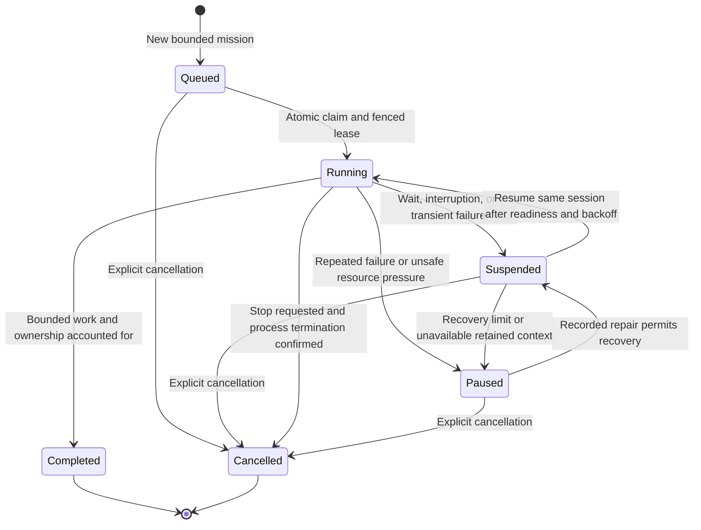

# Objective-led orchestration

Status: implementation contract for the v0.2.0 beta worktree.
See [architecture](../architecture.md) for the implemented behavior. Migration
`0028_objective_queues`, `0029_agent_planning`, `0030_optional_subagent_limits`
and new launches are explicit operator actions; source edits
do not convert deployed runs, existing review policy or pinned instructions.

## Direction

Give agents one global objective, a concrete mission, and tools to work. Let
agents choose mathematical strategy, decomposition, collaboration, and review
perspectives. Keep scheduling, permissions, durable ownership, and resource
accounting deterministic and small enough to explain.

The human supplies a draft `objective.md` and starts the desired work. Literature
review, milestone design, formalization, integration, and operational diagnosis
can then proceed with agent ownership. Human discussion through Zulip is optional.
Repository connections, credentials, host enrollment, and resource limits remain
installation configuration; they are not additional mathematical input.

The defaults are automatic transitions between requested phases after
maintainer acceptance, and permission for a session to finish after a faithful
delegation with a durable integration owner. These defaults apply to new objective launches. A blueprint-only objective need not launch
formalization or postprocessing. A human can pause automation or impose an
approval boundary in the objective or project configuration.

## Concepts and sources of truth

| Concept | Purpose and authoritative record |
| --- | --- |
| Objective | Global direction in a concise, versioned Markdown file in the roadmap repository; a stable objective ID locates it |
| Milestone | An ordinary graph node with a `milestone` label, source references and a Lean statement when appropriate; selected and reviewed by agents |
| Formalization graph | Reviewed decomposition and dependencies, linked to source-bound proof evidence |
| Mission | A bounded outcome assigned under the objective, including acceptance criteria and relevant scope |
| Goal ledger | The session's commitments, dispositions, comments, evidence, and delegated owners |
| Session | One durable agent identity and retained provider context working on a mission |
| Execution | One physical attempt to run or resume that session, with a fenced lease and resource claims |
| Queue category | A scheduling/configuration class, initially `work` and `maintenance` |
| Phase | An instruction profile and requested outcome, using the same orchestration mechanism |

Agents receive `objective_id`, its accepted revision, their mission, and their
phase. Internal IDs for hosts, execution leases, receipts, and provider threads
remain implementation details available for diagnosis. Hiding a run ID from
normal prompts does not require deleting useful internal execution history.
Resolve the objective by ID; do not copy a second editable global objective into
every mission or run. Revision changes are delivered explicitly so existing
sessions can adapt their plans without silently changing the meaning of evidence.

`objective.md` stays short, for example:

```markdown
# Project objective

- [x] Formalize M1 and M2.
- [ ] Formalize M3 and M4.
- [ ] Integrate the accepted results into the destination library.
```

Detailed routes, citations, proof attempts, and operational history live in linked
artifacts. Humans can edit the objective directly through their authorized Git
workflow. Agent edits, including checking completed items, use roadmap PRs accepted
by maintainers. Completion marks link to evidence; a tick alone establishes no
proof. A source revision anchors each accepted version.

## Two queue categories

Use **Work** and **Maintenance** in the UI, with `work` and `maintenance` in
configuration. A worker performs research, proofs, graph proposals, planning,
and library contributions. A maintainer decides on roadmap/library PRs, issues,
integration, and other authorized actions requiring greater permissions.

Each category has independent session slots, queue bounds, provider/model/effort
defaults, budgets, and retry policy. Future categories can be registered through
configuration. Category names do not grant authority: server-side capabilities
determine whether a session may publish workspace changes, propose a roadmap PR,
merge, or administer a particular resource. An agent cannot obtain merge or host
administration rights by changing its category.

There is one deterministic scheduler and one shared physical-resource accounting
mechanism. Maintenance can start while all work slots are occupied if the host
and provider have capacity. Separate category limits cannot guarantee immediate
execution on a machine with exhausted RAM, CPU, I/O, or provider quota. Reserve
enough capacity for lightweight maintenance/planning, and account for native
subagents and reviewer builds too. Native delegation is uncapped by Horizon by
default; explicit provider quotas still account for observed child activity.
Automatic provider guards track outages without deriving a child quota from host slots.

## Missions and the goal ledger

The effective session goal is its **mission and acceptance criteria, followed by
its open ledger items**, with links to the global objective and relevant graph
nodes. A short context update carries changed revisions and outstanding work.
Avoid repeatedly injecting the entire project history or requiring a separate
planning ceremony before an agent can start useful work.

The agent can create and refine concise Markdown items during its session.
Each item has a stable ID, Markdown description, comments, status, and structured
evidence/owner links. Useful dispositions are completed, delegated, superseded,
and blocked. Blocked remains outstanding; delegation transfers responsibility
without claiming the mathematical result is finished. Supersession names its
replacement and reason. The mission can seed the first item; a boilerplate list
of subtasks is unnecessary.

Allow revisioned mission clarifications, corrections, and justified extensions
within the agent's authority. Preserve the original contract and edit history.
An edit that removes a required result or weakens acceptance needs an explicit
maintainer decision, and a change to the global objective or an accepted
mathematical contract needs a roadmap PR. Agents should not need approval for
ordinary changes to their local proof plan.

The ledger can automatically check that commitments have dispositions, evidence
exists, replacement/delegation links are acyclic, and unfinished work has an owner.
It cannot prove that natural-language goals were satisfied, that children cover
every mathematical case, or that a mission edit is not avoidance. Lean evidence,
maintainer judgment, and targeted audits supply those checks when applicable.

A session may finish after delivering its bounded work or delegating the remainder
faithfully. The mission stays open until its actual acceptance criteria are met.
Delegation records child missions, their deliverables, and an integration owner
whose responsibility survives the parent session ending. Failed children return
to that owner and the planner. Passing an unchanged mission to a new session in
a chain is not progress; histories and budgets follow the work across handoffs.

## Phase instructions

Provide one concise skill for each phase, plus discoverable operational/reference
skills. Each phase describes intended outcomes and useful practices. Mathematical
strategy is guidance rather than a rigid sequence of mandatory agent roles.

### Preprocessing

Start from the human's draft objective. Review literature and import references,
including BibTeX, stable identifiers, and source locations needed for statement
fidelity. Refine the objective within the human's instructions. Propose a concise
set of milestones that covers the project and exposes useful intermediate results.
The number and granularity depend on the mathematics.

Roadmap PRs carry the proposed route, graph, milestone statements, and definitions.
Lean theorem skeletons may contain `sorry`; definitions and statement meanings
must remain concrete. Maintainers assess coverage and faithfulness and request
repairs as needed, choosing specialists when useful. Accepted contracts are
versioned and kept stable for ongoing work; ordinary graph projects have no
mandatory frozen-baseline verifier. Later discoveries can justify a reviewed
addition or amendment, with explicit treatment of dependent results.

### Main work

Complete the objective using the workspace. Agents write proofs, investigate
routes, coordinate, and propose graph additions, modifications, and deletions
through roadmap PRs. Workspace proof work has no routine PR acceptance gate.
The graph is a local strategy and evidence map; it is not a queue of mandatory
agent sessions. Scope/decomposition and mathematical dependencies remain distinct.

Keep source-bound evidence of proof completion. A theorem depending on an admitted
lemma is conditional until those dependencies are discharged. Contract and
objective corrections remain possible through reviewed changes. Removed graph
nodes retain historical identities and evidence; dependent edges must be repaired.

### Postprocessing

Begin with the complete workspace formalization. Revisit literature as useful,
append concise integration objectives, and propose an accepted strategy and
milestones for a high-quality destination library. Generalization, different
representations, and additional milestones can be appropriate.

Create a separate graph namespace for this phase, with stable IDs and provenance
links to the original nodes. A display name such as `M3′` is optional; identity
must not depend on a suffix. Prefer Lean namespaces/files such as
`Postprocessing.M3` and `Postprocessing/M3.lean` to ambiguous filename punctuation.
Keep these files on the workspace's visible main branch. Separate worktrees and
safe publication allow concurrent agents without sharing one mutable Git index
or overwriting another agent's edits.

The new graph expresses integration work independently while reusing sound
proofs and verification where applicable. Starting a new graph does not require
reproving the source results. Roadmap skeletons hold admitted milestones; the
destination library requires complete proofs, including checked dependency/axiom
closure. Library PRs explain their global purpose and link to the roadmap target.
Maintainers review their public interfaces, meaning, and verification. Workspace
completion and destination-library acceptance are separate facts.

## Maintenance triggered by review requests

An `awaiting-review` request on an eligible roadmap/library PR or issue creates
a maintenance session for that item. Publication can set the label automatically;
workers can request another round after addressing feedback. The maintainer may
review directly, use specialist subagents, or commission a focused audit. New
default projects do not require a fixed specialist panel. Repository protection,
actual authorization, current-source checks, and unresolved blocking findings
still apply; configured external policies cannot be bypassed by instructions.

The label is a visible request, not the sole durable trigger. Store an idempotent
review-request record with repository/item identity, request generation, source
revision (head/base for PRs), and owner. Duplicate webhooks, polling, or repeated
labels leave the same request and owner intact. Keep at most one running session
per item, coalesce pending requests, and supersede stale inputs explicitly.

When changes are requested, settle that review round and remove/project the label
only for the generation actually handled. A new request cannot be erased by a
late label update from an old round. Repair is assigned to the existing worker
session when it is resumable; otherwise the planner gives a new bounded mission
the feedback and original work. An interrupted maintainer resumes its existing
round. A finished round followed by a new request is new work and may use a new
maintainer context. Same-head requests explain new evidence or the decision
needed; label toggling alone must not reset a failure budget.

Before merging, recheck the actual head/base, required verification, and authority.
An approval of an earlier commit cannot authorize an unrelated changed diff.
Retain decisions, reviewer findings, and repairs on the PR so a fresh maintainer
can recover relevant context without the previous provider transcript.

## The recurring planner

The planner is a bounded `work` session. It reads the objective, graph, current
owners, previous session outcomes, queue readiness, and host/provider diagnostics.
It dispatches useful unowned work, diagnoses recurring failures, narrows blocked
missions, and preserves ownership of unfinished results. It should create graph
decomposition proposals when a mathematical blocker warrants them; provider or
storage failures instead need operational repair.

Maintain one planner in progress and at most one queued successor per objective.
Create that successor atomically when the current planner starts; if the current
planner must resume, the successor cannot run concurrently. Default successors
have no agent-authored dependency condition. Agents may attach a specific wait
when a known result is needed, including failed/cancelled outcomes and a way to
reconsider a stale wait.

An unconditional successor must not mean an immediately recurring model call.
Use a configured minimum cadence, an increasing delay for unchanged planning
passes, and early reconsideration when useful evidence arrives. Idle passes with
no useful decision eventually suspend planner recurrence with a visible reason;
an actual relevant event or a bounded health probe can wake it. This avoids
permanent human supervision without paying for an endless unchanged frontier.

Give planning a bounded opportunity while other workers run, through fair
scheduling or a small reservation within `work`. With one work slot, a busy
worker necessarily delays the planner unless it yields; do not silently exceed
the configured slots. Aim for a small useful queue ahead of available capacity.
Queue fullness and session count are not measures of mathematical progress.

## Session lifetime and recovery



These are user-facing states; paused/suspended sessions retain a pending
assignment with a pause reason or a wait, rather than adding database enum values.
New work enters the queue once. An unfinished session resumes with the same
session ID, mission, ledger, workspace, and available native provider context;
another execution lease does not create another session. Resume readiness can
participate in the same admission selection without being a fresh queue entry.
It consumes category and host capacity and cannot starve all new work indefinitely.

A provider turn stopping is not evidence of goal completion. Classify why it
stopped, reconcile uncertain side effects, inspect outstanding commitments, and
then complete, wait, resume, or pause it. Preserve failed attempts and delay
transient recovery using bounded exponential backoff with jitter. Count failures
across leases; changing IDs, editing a mission, or creating successors cannot
erase the same unresolved failure.

If the provider cannot resume a retained context, record that condition and pause
the session. A deliberate replacement can carry the workspace, ledger, provenance,
and remaining scope forward, but must be visible and authorized by recovery
policy. Do not claim native context preservation when it is unavailable.

Lease expiry alone does not prove that the old process stopped. Fence its API
writes, confirm termination or isolate it, and retain physical-resource claims
while occupancy is uncertain. Starting a replacement alongside a live orphan
would defeat both resource limits and single-owner guarantees.

## A small scheduler with bounded automation

Keep one scheduling path: observe/reconcile outcomes, update durable readiness,
ensure bounded review/planner ownership, and atomically claim admissible work.
Use database uniqueness and transactional claims for the planner successor,
review rounds, and active session leases; a Python check alone cannot handle
concurrent schedulers safely. Bound each scheduling pass and apply backpressure
before inserting new sessions. A full queue remains visible as deferred demand.

Persist a simple explanation for every blocked admission: dependency, delay,
category quota, provider backoff, host pressure, retained workspace, or pause.
Distinguish an intentional wait from an unknown or stale observation.

Use circuit breakers scoped to the failing session, automation, provider, or
host. Repeated identical failures, no-progress continuation loops, exhausted
budgets, or growing queue pressure can stop new admissions at the relevant scope.
Already running healthy work continues when safe. Pause reasons, attempts,
evidence, and recovery conditions remain visible. A limited probe or a recorded
repair can reopen the circuit; repeated planner sessions are not the health probe.
Hard configured spending limits remain hard. Emit one actionable incident and
update it instead of repeatedly posting or dispatching another investigator.

Thresholds, observation windows, cooldowns, and spending limits are named settings
with units and scope. Initial values are conservative tuning choices, documented
as such, rather than unexplained constants or claimed optimal thresholds.

## RAM, CPU, I/O, and storage

Treat agent concurrency and compiler concurrency as separate budgets. On a single
machine, several useful agent sessions may share one memory-heavy build slot.
Limit Lake/Lean process parallelism as well as simultaneous builds, and include
review validation, dependency restoration, and cache transfer in host admission.
CPU count alone is not a memory-capacity estimate.

Measure available memory, effective host/container limits, build peak usage, and
memory/I/O pressure where supported. Reserve control-plane and recovery headroom.
Use enforceable process/container limits where available; report an advisory
fallback honestly. Reduce admission under sustained pressure. A killed process
needs OOM evidence before being classified as an OOM failure. Retrying the same
heavy build unchanged on the same saturated host is not recovery: narrow its
targets, reduce parallelism, select another host, or pause it.

Share source-bound caches, coalesce identical builds, and bound concurrent
downloads/restores. Cache reuse must preserve toolchain/source identity and trust
boundaries. Surface queueing and deferred builds to agents as operational state,
so they can do other useful work instead of launching competing retries.
On a shared filesystem such as GPFS, local block-I/O controls may not limit the
remote traffic that causes contention. Bound checkout/cache-copy concurrency
and avoid repeated full-tree scans as well as limiting compiler processes.

Agents can inspect storage and request cleanup of managed disposable artifacts.
They can delete their own disposable scratch directly. Host-managed cleanup uses
registered roots, retention policy, and build/workspace leases, with an inspectable
candidate list. Age alone does not establish that a workspace is disposable.
Protect live and suspended workspaces, unpublished source, unmerged work, journals,
provider resume data, and evidence still needed for recovery. Prefer rebuilding
cache data to discarding unique work; record availability changes before admission
can select an evicted checkout. Never solve host pressure by allowing arbitrary
deletion outside managed roots or killing unrelated host processes.

## Native agents, dashboard, and shared memory

Keep the provider's ordinary tools, context management, and subagent experience.
Horizon adds scoped tools/skills, mission/goal continuity, observable execution,
and lifecycle enforcement. Use a provider's native goal facility where supported;
otherwise continue the same context with the concise outstanding goal through the
adapter. A short entrypoint explains the pipeline and points to CLI `--help`,
examples, current phase instructions, and scoped diagnostic/context commands.
Avoid mandatory startup sequences unrelated to the assigned work.

Render the mission, ledger descriptions, and comments as sanitized Markdown,
using the existing document renderer. Show a short mission title, open items
first, concise summaries, evidence/owner links, and expandable comments/history.
Collapse completed and superseded items by default; retain full content on demand.
Do not dump operational receipts into the main human-facing goal display. Link
to technical diagnostics instead. Preserve drafts during revision conflicts.

Use workspace Markdown for durable proof notes, failed approaches, and reusable
local knowledge, linking to commits and graph nodes. Put shared mathematical plans
in roadmap PRs when they change accepted strategy. Zulip is useful for coordination,
human instructions/questions, design discussions, and discoveries worth bringing
to other agents' attention. Summarize nontrivial brainstorming with a conclusion,
links, and next owner when appropriate. Search relevant topics rather than replaying
all chat or broadcasting every routine step. Promote lasting conclusions into
versioned notes or accepted artifacts so chat is not the only memory.

## Compatibility And Validation

Objective queues replace recurring legacy supervision for new launches. New
projects use `workflow: graph`; milestones supply display and agent strategy,
not mandatory compiler contracts. Existing strict projects retain their policy
until a human switches an idle project explicitly. Saved legacy orchestrator
profiles remain compatible, but new orchestrated launches are rejected.

Revision 0029 permits snapshot-free objective formalization and enforces that a
phase transition matches its previously recorded maintainer acceptance. General
library checks have a separate Lean API and worker lane; old milestone storage
identities and routes preserve historical leases and receipts.

The regression suites exercise duplicate/out-of-order review demand, planner
uniqueness, retained recovery history, uncertain physical occupancy, ledger
ownership, provider circuits, category capacity, pressure-based admission, protected
cleanup and exact-source admission audits. Full-suite and independent function
review evidence are recorded in the [manual review follow-up](review-follow-up.md).
Live-provider behavior still needs observation in a disposable project before a
beta or stable release is declared.

## Implementation And Operator Entry Points

- Launch with `horizon-pipeline launch-objective OBJECTIVE_UUID --operator NAME --apply`,
  or `POST /api/v3/records/run` with `objective_id`. Optional queue policies and
  requested phases are typed in `RunCreate`; launch without `--apply` prints them.
- `request_review`/`settle_review` manage durable review generations. A visible label
  is a recoverable projection. `request_maintenance` asks for another bounded
  privileged decision; it grants no authority to its caller.
- `accept_phase` records semantic acceptance and evidence. Transitions wait for the
  accepting session and deliveries; `auto_advance: false` requires a human resume.
- `comment_obligation` adds Markdown context. `resume_session` records a repair
  without clearing recovery attempts. `reset_circuit` is an operator decision.
- `retire_workspace` requests cleanup of settled generated checkouts; suspended
  owners and unpublished sources are protected by server and host checks.
- Three phase skills are `horizon-preprocessing`, `horizon-main-work` and
  `horizon-postprocessing`; the existing Lean tool skill remains `horizon-formalization`.

The scheduler's exact-copy check cannot decide whether arbitrary paraphrasing is
avoidance. Semantic mission edits, faithful delegation and mathematical coverage
still require evidence and maintainer judgment. Resource admission uses measured
pressure plus configured limits, not a prediction of every proof's memory peak.
Optional native capacity reservations are deliberately conservative; unused child
capacity can reduce primary throughput when a cap is configured. Uncapped sessions
retain native delegation without reserving primary slots. Library verification derives scope from Git and
fails import layouts it cannot resolve. Exercise this workflow on a disposable
project before changing a deployed project's ownership configuration.

## Code Review Map

| Start here | Invariant to review |
| --- | --- |
| [Request models](../../src/archon_horizon/pipeline/models.py), [migration 0029](../../src/archon_horizon/pipeline/migrations/versions/v0029_agent_planning.py) | New launches default to objective orchestration; existing persisted runs and review policies retain their behavior. |
| [Objective lifecycle](../../src/archon_horizon/pipeline/execution/objectives.py) | One planner and one successor; idle recurrence is bounded; phase acceptance waits for its owner and physical execution to settle. |
| [Scheduler](../../src/archon_horizon/pipeline/execution/scheduler.py), [queue policies](../../src/archon_horizon/pipeline/execution/queue_policies.py) | Category quotas share physical/provider reservations; interrupted sessions retain identity, context and recovery history. |
| [Mission service](../../src/archon_horizon/pipeline/missions/service.py), [commands](../../src/archon_horizon/pipeline/commands.py) | Agents cannot delegate their current mission or an unchanged renamed copy; repair commands require an attributable diagnosis. |
| [Review demand](../../src/archon_horizon/pipeline/review/demand.py), [connectors](../../src/archon_horizon/pipeline/integrations/connectors.py) | Duplicate observations reuse one owner; late label deliveries cannot erase a newer review request. |
| [Library verification](../../src/archon_horizon/pipeline/worker/lean_verify.py), [review decisions](../../src/archon_horizon/pipeline/review/decisions.py) | Exact-source verification derives the contribution scope and rejects admitted dependencies before acceptance. |
| [Resource observations](../../src/archon_horizon/pipeline/worker/resource_health.py), [build engine](../../src/archon_horizon/pipeline/worker/build_engine.py), [cleanup](../../src/archon_horizon/pipeline/worker/workspace_retention.py) | Pressure defers new work; audits share build limits; cleanup preserves unpublished commits, ignored notes and modified dependencies. |
| [Activity dashboard](../../src/archon_horizon/frontend/src/components/ActivityTab.tsx), [activity transport](../../src/archon_horizon/frontend/src/pipeline/DesktopActivity.tsx) | Markdown commitments remain readable; settled history is collapsed; recovery preserves revisions and command identity. |

[Objective regression tests](../../tests/test_pipeline_objectives.py) exercise
ownership, review generations, provider circuits, phase interruption, human
approval, resource observations, cleanup and real Lean admission checks. Existing
worker, review, database and HTTP suites cover the surrounding integration paths.
Browser fixtures use an isolated service and simulated provider state. Live
provider sessions and deployment behavior still need observation in an operator's
disposable project before a beta or stable release is declared.
