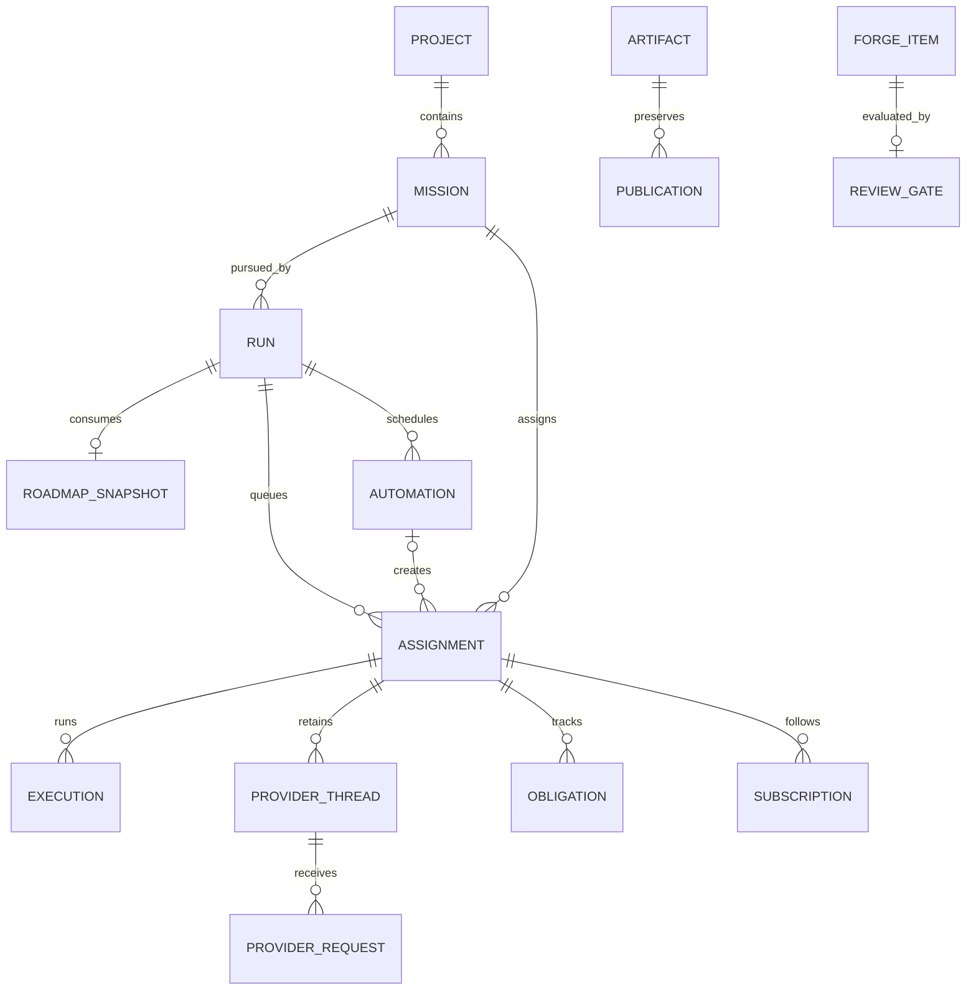

# Archon Horizon pipeline

This document describes the intended control plane for automatic Lean
formalization. A mission expresses intent. The control plane tracks ownership,
progress, reliability, and publication without prescribing one proof strategy.

## Schema scope

This is the design specification, not a generated database/API reference.
Its names are canonical throughout this document; consult the runtime's typed
models and authenticated `/api/v3/schema` for implemented request fields.

The main concepts are intentionally different. The implemented coordination
contract and agent procedure are described in [mission coordination](../mission-coordination.md).

| Concept | Question it answers | Lifetime |
| --- | --- | --- |
| `mission` | What outcome do we want? | Independent of execution |
| `run` | Under which phase and execution limits are we pursuing a mission? | An execution campaign |
| `assignment` | What queued assignment does one agent own? | Includes waiting and retries |
| `execution` | Which host currently owns one leased process? | One lease; retries create another execution |
| `provider_thread` | Which provider-owned state preserves model context? | Can survive several executions; not a human discussion |
| `provider_request` | Which input did we submit to the provider thread? | One provider interaction; the provider may call this a turn |
| `automation` | How is the next planning or maintenance assignment prepared? | Recurring assignment template |
| `obligation` | Is this piece of work done or durably accounted for? | Survives an individual process |
| `activity` | What durable progress or provider evidence was observed? | Append-only execution ledger |
| `reference` | Which bibliographic work does a citation key identify? | Project knowledge catalog |
| `roadmap_snapshot` | Which graph revision is the current formalization baseline? | Immutable provisional or frozen planning baseline |
| `review_gate` | Has a change met the review policy for its repository and phase? | Recomputed review decision |

Field dictionaries: [conventions](#common-conventions),
[knowledge](#project-and-knowledge-records), [execution](#execution-records),
[context/evidence](#context-and-evidence-records),
[hosts](#host-and-harness-records), [discussions](#discussion-and-inbox-records),
[identity](#identity-records), [reliability](#reliability-records).
The sections after these dictionaries explain behavior; they do not redefine
fields in a second schema. These are logical records: join tables and provider
projections are storage details, not extra agent-facing concepts.
Deployment and recovery are described in [setup](../pipeline-setup.md), runtime
boundaries in [architecture](../architecture.md), and review and source indexing
in the [documentation index](../README.md). These guides use the records and
lifecycle rules here, without creating separate queues or state.

There is no additional `task`, `job`, `session`, `profile`, `goal`, or `queue`
table duplicating these records. "Session" may be explanatory UI language for
an execution or provider thread, but is not another identifier. Zulip
`discussion` and `message` are the only shared communication records. A
`provider_thread` is internal provider state used to resume model context; it
is not a discussion and is not addressed as one. Native provider goal state is
an integration projection of the mission, not a second objective.



## Common conventions

The schemas below are a field dictionary, not YAML configuration examples.
Fields supplied by the bracketed record kind are inherited and intentionally
omitted from each block: every `Record` has `id` and `created_at`; every
`Mutable` record also has `updated_at` and `revision`.
`T?` means nullable with default `null`; `= value` gives a creation default.
Every other field is required. `List<T> = []` is an empty collection, never
`null`. `A | B` enumerates accepted values. `immutable` means write-once.
Defaults are applied on creation only; omitted PATCH fields remain unchanged,
and explicit `null` clears only a nullable field. Unknown fields are rejected.

| Type | Meaning |
| --- | --- |
| `Id` | Server-generated UUID; opaque and immutable, never parsed for meaning |
| `Ref<T>` | Foreign key to record T, validated within its scope |
| `Instant` | UTC timestamp, RFC 3339 in APIs; timezone-aware storage |
| `Seconds` | Nonnegative integer duration; suffix `_seconds` on fields |
| `Count` | Nonnegative integer; positive where stated |
| `Number` | Positive display number, allocated transactionally, never reused |
| `Text` | Nonempty UTF-8 text; no whitespace-only values |
| `Markdown` | UTF-8 Markdown with math; rendered with sanitization |
| `Boolean`, `Integer`, `Decimal` | Strict boolean, signed 64-bit integer, exact decimal; never coerced from strings |
| `URL` | Absolute validated HTTPS URL, with explicit trusted-local exceptions |
| `AbsolutePath` | Absolute path in the owning host's filesystem, not the API server's |
| `Slug` | Lowercase ASCII `[a-z][a-z0-9_-]{0,63}` |
| `RelativePath` | Repository-relative path; no leading slash, `..`, or NUL |
| `SecretRef` | Opaque reference to restricted secret storage, never the secret |
| `ObjectRef` | Validated tagged reference defined below, never an arbitrary URL |

`run_phase_kind = preprocessing | formalization | postprocessing`.
`forge_item_kind = pull_request | issue`.

All standalone records include `Record`: `id: Id`, `created_at: Instant`.
Mutable records add `Mutable`: `updated_at: Instant`, `revision: Count = 1`.
Archiveable records explicitly add `archived_at: Instant?`; this field is not
present on every table and is never a substitute for lifecycle `status`.
Server clocks set timestamps; revision changes in the same transaction as the
mutation. User/agent edits require `expected_revision`; conflicts return the
current revision. Internal heartbeat/lease commands instead use atomic
owner/epoch checks so telemetry cannot starve assignment edits. Append-only
records have no fake `updated_at` or revision column.
Join relations use their listed composite key and have no redundant UUID.

Use `status` consistently for lifecycle, `kind` for a discriminated variant,
`role` for authorization, `functions` for skill hints, `*_id` for a single
reference, and `*_ids` for a collection. All status and ownership transitions
are service commands, not arbitrary client edits. API read models may embed
records, but embeddings are projections, not extra stored copies.

`ObjectRef` is one of: `{kind: project|repository|mission|run|assignment|execution|
provider_thread|provider_request|automation|obligation|activity|node|document|reference|
roadmap_snapshot|review_policy|reviewer_descriptor|integration_identity|review_gate|
forge_review|forge_item|discussion|message|artifact|publication|host|harness|
workspace|verification,
id: Id}` or
`{kind: file|directory, repository_id: Id, path: RelativePath}`. Each variant
accepts exactly its declared fields. Relational storage uses typed foreign
keys with an exactly-one-target constraint, not an unconstrained `(type,id)`
pair. Paths are resource selectors; revision-specific content is an artifact.

Project ownership is stored at the nearest owning entity and inherited through
foreign keys. Cross-project references are rejected unless a relation
explicitly permits read-only external evidence. Resource lookup always checks
authorization. Hierarchies are acyclic. Foreign-key deletion is restricted for
historical records; archiving is explicit and never a status synonym.

Editable business records have immutable `record_revision` snapshots:
`Record + object: ObjectRef, object_revision: Count, schema_version: Count,
actor_principal_id: Ref<principal>, content: ValidatedSnapshot`.
Unique `(object, object_revision)`; content is typed by record kind and schema
version and excludes secrets. Only project, mission, node, document, reference,
assignment instructions, automation, harness configuration, review policies,
and reviewer descriptors use these
snapshots; telemetry/heartbeat changes do not duplicate whole records.
Pinned revisions are foreign keys to these snapshots. This deliberate history
is not a second mutable source of truth.

## Project and knowledge records

```text
project [Record + Mutable]
  number: Number                         # installation-wide
  slug: Slug                             # unique; immutable canonical namespace
  title: Text
  description: Markdown = ""
  archived_at: Instant?

integration [Record + Mutable]
  kind: forge | zulip
  endpoint: URL                          # HTTPS outside trusted local transport
  credential_ref: SecretRef
  enabled: Boolean = true

repository [Record + Mutable]
  project_id: Ref<project>                # immutable
  slug: Slug                             # unique within project; immutable
  integration_id: Ref<integration>        # forge only
  remote_id: Text                         # provider identity, not display URL
  remote_path: Text?                      # forge path/slug when the provider exposes one
  default_branch: Text
  purpose: workspace | knowledge | reference | library
  archived_at: Instant?

document [Record + Mutable]
  project_id: Ref<project>
  number: Number                         # unique within project
  kind: roadmap | specification | notes | reference_list
  title: Text
  source_repository_id: Ref<repository>  # forge repository containing the source
  source_path: RelativePath               # path in that repository
  source_commit_oid: Text                # indexed content revision
  archived_at: Instant?

node [Record + Mutable]
  project_id: Ref<project>
  number: Number                         # unique within project
  title: Markdown                        # short, inline Markdown/math
  source_repository_id: Ref<repository>  # forge repository containing the source
  source_path: RelativePath               # path in that repository
  source_commit_oid: Text                # indexed content revision
  archived_at: Instant?

node_dependency [composite key]
  child_node_id: Ref<node>               # this node depends on the parent
  parent_node_id: Ref<node>

mission [Record + Mutable]
  project_id: Ref<project>                # immutable
  number: Number                         # unique within project
  parent_id: Ref<mission>?
  roadmap_document_id: Ref<document>?    # project roadmap anchor; must be kind=roadmap
  title: Markdown                        # short, inline Markdown/math
  objective: Markdown                    # sole authoritative mission prompt
  acceptance_criteria: List<Text> = []    # nonempty for delegated children
  delegation_note: Text?                 # required for a child; parent contribution and integration
  scope: MissionScope                    # child inherits when omitted at creation
  max_open_children: Count = 8           # positive, enforced transactionally
  status: open | completed | cancelled = open
  closed_at: Instant?
  closure_note: Markdown?
  archived_at: Instant?

MissionScope = {node_ids: List<Ref<node>>, document_ids: List<Ref<document>>,
                repository_paths: List<{repository_id: Ref<repository>, path: RelativePath?}>}

mission_node [composite key]
  mission_id: Ref<mission>
  node_id: Ref<node>                     # node relevant to this mission

mission_document [composite key]
  mission_id: Ref<mission>
  document_id: Ref<document>              # supporting source, not the roadmap anchor

reference [Record + Mutable]
  project_id: Ref<project>
  cite_key: Slug                          # stable project-local citation key
  kind: article | book | inproceedings | thesis | report | webpage | dataset | other
  title: Text
  authors: List<Text>                     # normalized author names, in citation order
  issued_year: Integer?
  venue: Text?
  identifiers: ReferenceIdentifiers
  urls: List<URL> = []
  abstract: Markdown?
  metadata_source: Text?                  # DOI/arXiv/manual/import provenance
  status: active | incomplete | withdrawn = active
  archived_at: Instant?

ReferenceIdentifiers = {doi?: Text, arxiv?: Text, isbn?: Text, pmid?: Text}

reference_usage [Record; immutable]
  reference_id: Ref<reference>
  subject: ObjectRef                     # node, document, or artifact containing the citation
  locator: Text?                          # section, line, or local citation marker
  cited_as: Slug                          # resolved cite_key at use time

review_policy [Record + Mutable]
  project_id: Ref<project>
  slug: Slug                               # unique within project
  maintainer_identity_id: Ref<integration_identity>? # Explicit final-review account, distinct from PR authorship.
  repository_ids: List<Ref<repository>>    # nonempty, explicit repository scope
  phases: List<run_phase_kind>             # nonempty; OR within each selector
  reviewer_descriptor_ids: List<Ref<reviewer_descriptor>> = [] # available tools, not mandatory passes
  instructions: Markdown                  # quality expectations and reviewer-selection guidance
  required_checks: List<Slug> = []         # Forge checks that must pass
  attention_labels: List<Text> = ["awaiting-review"] # wakes the maintainer only
  enabled: Boolean = true

integration_identity [Record + Mutable]
  integration_id: Ref<integration>
  principal_id: Ref<principal>             # service/human identity for remote actions
  remote_user_id: Text
  credential_ref: SecretRef
  enabled: Boolean = true

reviewer_descriptor [Record + Mutable]
  project_id: Ref<project>
  slug: Slug                               # unique within project
  functions: List<Slug>                    # prompt/skill hints, not permissions
  instructions: Markdown                   # reviewer-specific rubric
  guidance_document_ids: List<Ref<document>> = [] # pinned project guidance
  harness_id: Ref<harness>?
  model_options: ModelOptions = {}
  invocation: subrequest | assignment = subrequest
  integration_identity_id: Ref<integration_identity>?
  enabled: Boolean = true

forge_review [Record; immutable external projection]
  forge_item_id: Ref<forge_item>             # must be a pull_request
  remote_id: Text                          # unique within the Forge integration
  reviewer_remote_id: Text
  reviewer_principal_id: Ref<principal>?
  reviewer_descriptor_id: Ref<reviewer_descriptor>?
  reviewer_descriptor_revision_id: Ref<record_revision>?
  provider_request_id: Ref<provider_request>? # provenance of an automated rubric result
  integration_identity_id: Ref<integration_identity>?
  reviewer_functions: List<Slug> = []
  verdict: approved | changes_requested | commented | dismissed
  summary: Markdown                       # findings or maintainer's merge rationale
  commit_oid: Text                         # reviewed head at the time
  observed_at: Instant

review_gate [Record + Mutable]
  forge_item_id: Ref<forge_item>             # must be a pull_request
  policy_id: Ref<review_policy>
  policy_revision_id: Ref<record_revision>
  maintainer_review_id: Ref<forge_review>? # final maintainer decision for this head
  status: pending | accepted | rejected | stale = pending
  accepted_commit_oid: Text?
  evaluated_at: Instant?

roadmap_snapshot [Record; immutable]
  project_id: Ref<project>
  roadmap_document_id: Ref<document>       # must be kind=roadmap
  source_commit_oid: Text
  graph_manifest_artifact_id: Ref<artifact> # exact node revisions and edges
  acceptance_artifact_id: Ref<artifact>?  # immutable exact-head decisions; required when frozen
  status: provisional | frozen = provisional
  frozen_at: Instant?
```

The mission API exposes `node_ids` and `document_ids` from these join tables and
also exposes a structured delegation `scope` of node IDs, document IDs and
repository-relative paths. `mission_node` means a node is relevant to the mission;
`mission_document` means a document is supporting source material. Scope bounds
delegated descendants; it does not duplicate graph content. `roadmap_document_id`
is the one explicit strategy anchor, while the document join carries additional
sources. Repository content is canonical for documents/nodes; indexed
title/source revisions carry the indexed Git commit in their snapshot. The
database does not introduce another mutable proof text.

`node_dependency` stores one canonical direction: `child_node_id` depends on
`parent_node_id`. Queries index both columns to retrieve parents or children;
the reverse edge is never stored as a second row. Likewise, a mission stores
only `parent_id`; child missions are an indexed query. This gives intuitive
write semantics without two copies that can disagree. A source locator is the
pair `(source_repository_id, source_path)`. The repository owns its
`integration_id`, so nodes and documents remain valid when a project has more
than one forge integration without duplicating a value that could drift.

Each Git-backed node can contain `implementations[repository_id]`: identical
progress states for workspace and library, independent review status, immutable
implementation/evidence pins and a content digest. The node body is the current
mathematical description, not an accumulation of old proofs; Git preserves prior
versions. A rewrite invalidates mismatched progress evidence. Optional per-target
`children` override shared prerequisites and are validated as a complete acyclic
graph. The indexed `node_dependency` table remains the shared graph; target views
derive overrides from the same source projection. Phase/run selection chooses a
target view rather than creating duplicate mathematical nodes. Deleted source
files disappear from the current graph without deleting historical mission IDs.
See [repository progress](../../src/archon_horizon/pipeline/skills/operations/horizon-graph/references/repository-progress.md).

`document` is not the bibliography. It represents a project source file such
as a roadmap, specification, notes, or a maintained reference list. `reference`
is the normalized bibliographic catalog. The reference API returns a stable
`cite_key`, normalized metadata, and deterministic BibTeX from the database;
agents do not need to copy a BibTeX blob into every node. Each use is recorded
by immutable `reference_usage`, so citation counts are derived rather than
incremented in a mutable counter. Missing authors or publication year derive
an `incomplete` status; `withdrawn` remains an explicit decision. Existing
maintenance assignments can inspect incomplete entries in bounded batches and
update verified metadata without blocking a lookup. There is no autonomous
metadata crawler or additional refresh queue; normal lookups are indexed and local.
`cite_key` is unique within a project; DOI, arXiv, ISBN, and PMID values are
normalized and uniquely indexed within the project for deduplication. Equivalent
resolver URLs and identifier prefixes are accepted. DOI case is normalized,
ISBN checksums and ISBN-10 conversion use `python-stdnum`, and arXiv versions
remain in citations while their common work identity prevents duplicate entries.
A conflict returns existing reference IDs for explicit correction, never silently
replaces metadata or a cited version. BibTeX is generated with stable
escaping and field ordering, so the same reference revision always produces
the same export.
The forge `/references` directory can be a generated export or human-facing
curated file, but it is not authoritative. Hosts may cache generated entries
under the workspace's `.horizon/reference-cache/`; the cache is disposable and
validated against the reference revision, content digest, and ETag. Every cache
read first makes an authenticated conditional request to Horizon, including
cache hits; revoked access and outages never return stale cached content.
The worker cache defaults to 8 MiB, 512 entries, and 256 KiB per response,
partitions entries by API endpoint and credential, and evicts least recently
used entries. It only downloads generated BibTeX from the configured Horizon
endpoint; it does not fetch arbitrary document URLs on the server.

Node formalization labels, evidence, and source citations remain in the
versioned node document and are computed projections, not additional editable
database columns or a binary proof status. A dependency edge means a
mathematical prerequisite, not execution
ordering. Forge owns PR content/reviews; Horizon stores the projection below.
Detailed private schemas of Forge, Zulip, and provider runtimes are outside
this database contract.

A preprocessing run publishes roadmap changes through Forge pull requests
using the `review_policy` matching that repository and `preprocessing`. Horizon may create a
`provisional` roadmap snapshot as soon as the graph manifest is coherent, so
formalization can begin while review continues. It creates a `frozen` snapshot
only after every contributing gate is accepted for the exact head commit. The
snapshot's graph manifest records the node revisions and dependency edges that
were reviewed. A later roadmap correction creates a new reviewed change
and new snapshot; it never mutates an old baseline. Zulip discussion can
request a correction, but a message alone cannot rewrite a snapshot.

Review configuration has two responsibilities. A `reviewer_descriptor` defines
how to review; a `review_policy` binds the available descriptors and quality
guidance to repositories and phases. Repository membership AND phase
membership must match. Do not repeat these selectors on descriptors or use a
descriptor's presence in the vendored catalog to enable it. Policy creation
validates project ownership, unique descriptor references, enabled
descriptors, and non-overlapping enabled repository/phase pairs. Multiple
rubrics belong in one policy, not competing policies selected by priority.
The maintainer sees which descriptors are currently available. For proportional
roadmap policies it may address a concern directly, select another specialist,
or defer with a reason. A required postprocessing dimension remains uncovered
until it has an eligible assessment or explicit evidence-backed carry-forward;
an unavailable reviewer is a capacity/configuration issue, not implicit approval.

Repository permissions independently define which target branches require a
reviewed merge. An unmatched policy on such a branch blocks merging with a
configuration error; an unmatched policy on a workspace branch adds no review
gate. Defaults protect the roadmap and library, and allow workers to push to
the shared workspace. This distinction also applies to manually opened PRs.

`review_gate` records the authorized maintainer's decision for the exact PR head,
subject to repository permissions and required Forge checks. It does not count
rubric approvals or impose a reviewer sequence. The maintainer reads the diff,
phase guidance, and existing discussion; it decides whether to merge directly,
repair the branch, invoke reviewers, or request changes. A trivial PR can merge
without any specialist invocation, including during a strict phase. Its short
Forge approval explains why that level of review is sufficient. Strictness
describes the expected quality and depth of judgment for substantive changes,
not a minimum number of agent calls.

Before merging, the maintainer accounts for findings and selected review work:
resolve them, explain why they do not apply, or cancel a now-unnecessary review
with a reason. It does not silently ignore an outstanding objection. Reviewers
provide advice; merge authority remains with the maintainer. Repository-enforced
permissions and checks still apply to a direct merge. Unmapped Forge approvals
remain informative but cannot supply the maintainer decision. A changed PR head
invalidates the gate; the maintainer inspects the delta and chooses which, if
any, reviewers need to run again before approving the new head. Required checks
likewise cover the final head. Review is not rerun merely because a webhook was
delivered twice. The gate pins the policy revision; actual reviewer invocations
pin their descriptor revisions. An authorized policy change explicitly
re-evaluates pending gates rather than
quietly changing requirements or rewriting historical acceptance.

The same mechanism serves strict preprocessing roadmap review, lightweight
formalization roadmap review, and strict postprocessing library review.
Workspace commits and PRs have no automatic reviewer roster in any phase.
A provisional roadmap is an explicit input state, not a bypass of required
roadmap review.

Descriptors' rubrics, functions, model options, invocation modes, and optional
Forge identities are configuration, not permission grants. A maintainer
normally invokes descriptors as provider subrequests, which keeps
one Horizon assignment and one queue slot while preserving separate review
provenance. The subrequest remains visible in `provider_request`, `activity`,
and usage records and consumes provider-local budget; it is not an invisible
side channel. A descriptor may request a full assignment when its rubric needs
independent workspace time, or the maintainer can choose it when the selected
harness has no native subagent capacity. Preparation is the same scoped command:
it pins the Forge head, policy, descriptor, guidance source commits, harness
revision, skill bundle, and model options. A queued reviewer is an ordinary
worker assignment with a scoped mission and one immutable `reviewer_manifest`
artifact link; it reserves capacity only when dispatched. Its primary provider
requests carry the same review provenance as native children. The maintainer
gets an open review obligation and may explicitly delegate it before yielding
its slot. Queueing by itself does not close that obligation. The reviewer publishes
its own report through its scoped invocation endpoint under its configured Forge
identity, then returns the delivery receipt to the parent. Publication is separate
from process completion. Comments identify the descriptor, pinned rubric, provider
request and reviewed head. Repeated rubric invocations do not count as independent
votes toward a merge quota.

An `integration_identity` used by a reviewer must belong to a Forge
integration and be authorized only for the repositories covered by its policy.
The default project uses a maintainer Forge identity for final approval and
distinct configured reviewer identities for specialist reports. Setup provisions
and links those native accounts; descriptor names alone do not create permissions.
Authorized maintainer executions receive a private account mapping for native
Forge discussion operations. The reviewer-owned report API remains the durable
publication path, and credentials must never appear in prompts, logs or reports.
When independent review is useful,
the maintainer invokes a reviewer in a separate context from the author.
Horizon never fabricates reviewer names or silently posts a review
under a human account that was not selected by the descriptor. A review gate
controls whether a Forge change may enter a protected branch; it does not turn
semantic mission completion into a fixed checklist.

`mission.status` describes intent, never process health. A failed worker does
not fail a mission. "Blocked" is a described obstacle with a reconsideration
route, never a permanent mission state. Terminal missions require `closed_at`
and `closure_note`; reopening explicitly clears those current fields while
history remains. Archiving requires no active run/items. Completion remains a
reasoned semantic decision: no mandatory declaration/build acceptance list.
Delegation accounts for a session's work but does not complete the mission.

## Execution records

```text
run [Record + Mutable]
  number: Number                         # installation-wide
  mission_id: Ref<mission>                # root mission; immutable
  phase: RunPhase                         # immutable behavior and initial input provenance
  adopted_roadmap_snapshot_id: Ref<roadmap_snapshot>? # current baseline; initially phase's snapshot
  status: active | paused | draining | stopping | completed | cancelled = active
  status_note: Markdown?
  started_at: Instant?
  finished_at: Instant?
  max_assignments: Count?                # total admissions, not retry count
  token_budget: Count?                   # null = uncapped
  expires_at: Instant?                   # null = no campaign deadline
  retry_policy: RetryPolicy

RunPhase = {kind: preprocessing,
            roadmap_document_id: Ref<document>}
          | {kind: formalization,
             roadmap_snapshot_id: Ref<roadmap_snapshot>}
          | {kind: postprocessing,
             source_workspace_id: Ref<workspace>,
             source_commit_oid: Text,
             target_repository_id: Ref<repository>}
```

The phase validator enforces the discriminant: preprocessing requires a
roadmap document in the same project;
formalization requires a provisional or frozen snapshot
in the same project as the mission; postprocessing requires a ready workspace and
pinned commit in the same project plus a `library` target repository and a
matching review policy. At admission the daemon
verifies the workspace contains `source_commit_oid` and records a durable
source artifact/checkout; workers may then run on any enabled compatible host.
Admission checks that the intended protected repositories have matching policies.
The maintainer receives the available descriptors and any availability failures.
Policy resolution uses the
destination repository and phase of each Forge item, not a single policy on the
run: one run may publish workspace commits and submit reviewed roadmap changes.
For a provisional roadmap snapshot, acceptance evidence may be absent; a frozen
snapshot requires an acceptance artifact and non-null `frozen_at`. The artifact
captures the contributing heads, maintainer reviews, and policy revisions when
their gates were accepted. Later gate changes cannot rewrite that evidence.
Supersession is derived from baseline adoption, not a mutable snapshot status.

```text
run_host [composite key]
  run_id: Ref<run>
  host_id: Ref<host>
  enabled: Boolean = true

assignment [Record + Mutable]
  run_id: Ref<run>                        # immutable; supplies project scope
  number: Number                         # unique within run
  mission_id: Ref<mission>                # same project; immutable
  parent_id: Ref<assignment>?             # delegator; same run, immutable
  automation_id: Ref<automation>?         # creator trigger; immutable
  reviewer_descriptor_id: Ref<reviewer_descriptor>? # only for explicit review assignments
  role: worker | maintainer = worker
  functions: List<Slug> = []
  instructions: Markdown?                  # optional focus, not copied objective
  harness_id: Ref<harness>?               # null lets scheduler choose enabled host capacity
  model_options: ModelOptions = {}
  status: pending | running | stopping | completed | failed | cancelled = pending
  status_note: Markdown?
  queue_rank: Integer                    # assigned by server at enqueue
  not_before: Instant?
  expires_at: Instant?
  start_condition: Condition?
  retry_at: Instant?                     # scheduler-owned, not user delay
  started_at: Instant?                   # first execution start
  finished_at: Instant?

execution [Record + Mutable]
  assignment_id: Ref<assignment>           # immutable
  number: Number                         # unique within assignment; fencing epoch
  host_id: Ref<host>                      # immutable
  workspace_id: Ref<workspace>            # immutable
  assignment_revision_id: Ref<record_revision>
  mission_revision_id: Ref<record_revision>
  harness_revision_id: Ref<record_revision>
  skill_bundle_artifact_id: Ref<artifact>
  roadmap_snapshot_id: Ref<roadmap_snapshot>? # adopted baseline at execution start
  sandbox_manifest_artifact_id: Ref<artifact> # resolved isolation configuration, secret-free
  status: starting | running | stopping | succeeded | failed | cancelled | lost = starting
  lease_expires_at: Instant
  heartbeat_at: Instant?
  started_at: Instant?
  finished_at: Instant?
  stop_confirmed_at: Instant?             # observed physical cleanup; lease expiry alone never sets this
  failure: Failure?

provider_thread [Record + Mutable]
  assignment_id: Ref<assignment>
  number: Number                         # unique within assignment
  kind: primary | child = primary
  parent_request_id: Ref<provider_request>? # required for child; null for primary
  workspace_id: Ref<workspace>
  harness_revision_id: Ref<record_revision>
  skill_bundle_artifact_id: Ref<artifact>
  provider_thread_id: Text?              # null until provider acknowledges create
  provider_state_ref: Text               # host-local durable storage locator
  predecessor_id: Ref<provider_thread>?
  recovery_note: Markdown?               # required for a replacement provider thread
  applied_mission_revision_id: Ref<record_revision>?
  applied_roadmap_snapshot_id: Ref<roadmap_snapshot>?
  applied_run_revision: Count?             # orders baseline-adoption updates
  applied_model_options: ModelOptions    # resolved, not partial overrides
  status: creating | available | unavailable | closed = creating

provider_request [Record + Mutable]
  provider_thread_id: Ref<provider_thread>
  execution_id: Ref<execution>             # authorized submitter/lease epoch
  number: Number                         # unique within provider thread
  reason: assignment | continuation | notification | mission_update | native_goal | review
  reviewer_descriptor_id: Ref<reviewer_descriptor>?
  reviewer_descriptor_revision_id: Ref<record_revision>?
  guidance_manifest_artifact_id: Ref<artifact>? # exact document commits/content for review
  input_artifact_id: Ref<artifact>?        # native automatic request may have no input
  provider_turn_id: Text?
  native_background: Bool? # Observed native invocation mode; unknown until reported, then immutable.
  status: pending | submitted | running | completed | failed | interrupted | uncertain = pending
  submitted_at: Instant?
  started_at: Instant?
  finished_at: Instant?
  failure: Failure?
```

`role` replaces both `profile` and duplicated permission labels. Server policy
authorizes changes; requesting maintainer in a body never grants it.
`functions` replaces `profile_functions`; examples are `planner`, `debugger`,
`reviewer`. Values must exist in the pinned skill catalog, have no permission
effect, and are de-duplicated. No separate proof/build/integration profiles.
Assignment fields can change while pending; changing them during execution
uses an explicit revisioned command at a provider-request boundary, never a silent edit.

`ModelOptions = {model?: Text, reasoning_effort?: Text}` is a partial object;
omitted keys inherit harness defaults, supplied keys must be accepted by its
adapter. No explicit nulls or free-form CLI/environment overrides. Provider
configuration belongs to the operator-owned harness. Resolve configuration at
first claim, pin it in the execution/provider thread, and reuse on retries; applying
new defaults or switching models is an explicit operation.

`applied_model_options` includes the effective model and, when the adapter
supports it, effective reasoning effort, even when inherited. A new execution
cannot independently change the configuration of the provider thread it resumes.

`RetryPolicy = {max_recovery_attempts: Count >= 1, initial_delay_seconds: Seconds > 0,
max_delay_seconds: Seconds > 0, max_no_progress_requests: Count >= 1}`; run creation
materializes explicit operator defaults. Backoff is capped exponential with
jitter; only classified transient failures retry. Authentication/configuration
failures wait for repair. `Failure = {kind: provider|transport|host|storage|
configuration|execution, code: Slug, message: Text, diagnostic_artifact_id?: Id}`.
Retryability comes from policy and error code, not an agent-written boolean.

Mission changes create a new revision and a durable goal-update command for
affected provider threads. Advance `applied_mission_revision_id` only after
acknowledgement. Executions retain the revision they started with; provider
threads track the last revision applied. This historical difference is deliberate.
An authorized agent may revise its own mission subtree through the same
revisioned command, subject to parent revisions, scope containment, child budgets
and lifecycle checks. A child cannot silently broaden its parent's authority.
The next goal envelope includes the new revision while existing obligations
remain visible until explicitly resolved or superseded.
Commands are serialized per primary thread. Coalesce unsent goal updates and
ignore obsolete revisions; delayed acknowledgements cannot move the applied
revision backward. The same update path carries a new adopted roadmap baseline.

`adopt_roadmap_snapshot` is a revisioned run command: validate the new snapshot's
project/document and review evidence, update `adopted_roadmap_snapshot_id`, and
record the old/new baseline and affected assignments in one transaction. New
claims use the adopted baseline; active contexts receive a targeted delta at
their next safe boundary and reconsider affected obligations. Keep the initial
snapshot in `phase` as provenance. A rollback is a new adoption event, not a
rewrite of execution history. Applied updates are ordered by the run revision,
not by snapshot ID.
The adopted field is required for formalization and initially equals its input
snapshot; it is null for runs that do not consume a roadmap baseline. A baseline
update is applied before starting another request that depends on changed claims.

### Scheduling and transitions

`pending -> running -> completed` is the usual agent lifecycle. Transient
execution failure returns the item to `pending` with `retry_at`; exhausting
retry policy makes the item `failed`, not the mission. Explicit retry of a
failed item returns it to pending and preserves its executions/provider threads.
A successful execution only means its owned process ended normally; it does
not prove the mission or close an item with unhandled obligations. Ordinary
continuations and voluntary yielding do not consume the recovery-attempt limit.

Keep failure handling in one transition service, shared by daemons, scheduler,
and watchdog. Transport errors are not automatically assignment failures:

| Observation | Durable action | Agent consequence |
| --- | --- | --- |
| API temporarily unavailable | Journal the authorized operation; retry delivery with backoff | Continue only within the current lease, then checkpoint and stop |
| Provider request fails transiently | Record request failure and schedule bounded retry after reconciliation | Resume the same context when possible |
| Process/host lost | End execution as failed/lost, fence ownership, reclaim resources | Resume the same assignment in a new execution after safe recovery |
| Credentials/configuration invalid | Retain pending work behind the unavailable harness/service | Deterministic health checks wait for repair; do not repeatedly launch agents |
| Recovery budget exhausted | Fail the assignment and retain its ledger/artifacts | Record one reconsideration route, not a chain of duplicate assignments |
| Cancellation or expiry | Stop the assignment regardless of open obligations | Preserve unfinished work; never automatically resurrect the cancelled assignment |

Ending an execution and accounting for remaining mission work are separate
operations. Failure/cancellation transitions preserve open obligations and
record reconsideration durably in the same transaction when the API is reachable;
offline observations are replayed by the daemon. If the run remains active,
the planner or an existing owner receives the follow-up. If the run was cancelled,
unfinished work remains visible on the mission without launching new sessions.
Only a successful assignment completion requires the ledger to be accounted for.

Cancellation of pending work is immediate. Cancellation/expiry of running work
enters `stopping`, fences new side effects, and asks the daemon to checkpoint
and terminate; `finished_at` is set after stop confirmation or fenced lease
loss. A still-reachable old process cannot publish under an expired epoch.
Expiry uses `cancelled` plus an expiry event/reason; no duplicate `expired`
status. Require `not_before < expires_at` when both exist. Evaluate expiry
before conditions. Host-local monotonic deadlines enforce the granted lease
even during an API outage; API unavailability alone does not grant an extension.

The effective earliest start is `max(not_before, retry_at)` over present values.
Null `start_condition` imposes no extra condition. `ready`, `waiting`,
`backoff`, `leased`, and `why_waiting` are derived from the item, its active
execution, conditions, run status, and capacity; do not store independent copies.
An atomic claim checks all of these, creates one execution, and reserves capacity.
Unique partial constraints permit one live execution and one creating/available
primary provider thread per item, and one active provider request per individual
thread. Child threads can run concurrently under that execution. Each child
has a parent invocation, its own provider context identifier, pinned rubric and
guidance when applicable, lifecycle, and usage. Provider-native children are
mirrored into these records rather than also submitted as a second provider
request. An adapter without native child support may implement isolated child
processes through the same interface; otherwise advertise serial-only support
explicitly. No child thread consumes another scheduler assignment slot.
`execution.number` is the fencing epoch for that item; all mutations check both
execution identity and current lease.

Queue ordering uses `(queue_rank, id)` within a run. Enqueue appends; the API
offers `move_before`/`move_after` instead of accepting raw rank edits. Lock the
run's queue order while allocating/rebalancing ranks. Skip ineligible entries,
apply fair selection across runs, then claim. No parallel `priority` or list
of queued IDs. Concurrent rank changes require expected revisions. Reordering
cannot preempt a running execution.

Workers and maintainers use the same slots and queue. An authorized agent can
move urgent maintenance ahead of other pending work with the ordinary queue
operation. Priority means next eligible start, not immediate interruption.
Minimum parallelism of two does not guarantee that a slot is immediately free.
A worker finishes after its verified PR delivery, without waiting for review
or merge. Later requested changes are separate scoped work for a planner or
new worker; maintainers may make bounded fixes directly. Maintainers publish
their review decisions or integrate ready work and finish a bounded pass without
waiting for authors. Planners queue ready work, configure their recurrence and
finish without waiting for the dispatched agents. Put genuine dependencies on
future queued work, not repair-only retained sessions. Keep incomplete mathematics
visible and durably assigned; publishing a PR is not proof of acceptance.
Checkpoint remains available for transport/publication recovery. It ends the execution, keeps the assignment
pending with its existing provider context and a start condition, and releases
capacity after its processes/children are stopped or confirmed settled. Resume
uses that context; it does not create a new mission or a fresh briefing.
Useful active work is not killed merely to admit a maintainer. Long-running
calls have configured deadlines and cancellation/checkpoint paths; deployments
needing tighter maintenance latency can raise shared capacity.

Run pause stops new admission, while active work may checkpoint/finish. Resume
is explicit or a recorded scheduled recovery; pause does not erase pending
work. Cancellation enters `stopping` until its executions stop. Successful
closure atomically enters `draining` after a semantic mission-completion decision,
disables recurring admissions, and cancels unused pending recurrence occurrences.
Already tracked work and publication can drain; necessary repair/review work is
explicitly admitted to that drain. New substantive findings reopen the mission
and return the run to active through a recorded command. Complete only after
the mission is still complete and tracked work is settled. Locks/revision checks
prevent recurrence racing this transition. Limits stop admission and record
the reason; limits never imply semantic completion. Phase configuration is
validated at admission/adoption; claims check generic pinned prerequisites,
permissions, available artifacts, and capacity rather than branching on phase.

Provider restart creates another execution only after ownership is recovered or
the old lease is fenced. Resume the existing provider thread and workspace.
Ordinary continuation adds a provider request, not an assignment or execution.
Missing provider history requires a new provider thread with `predecessor_id`
and a recovery note. No silent fallback to an unrecorded thread. A lost
submission response leaves the provider request `uncertain` until reconciled;
do not blindly send it twice. Every adapter has a reconciliation deadline and
three explicit outcomes: observe the original result, establish non-submission
and retry, or isolate/stop the old execution and recover from preserved state.
A timeout is not evidence that remote work stopped. Unknown remote calls remain
recorded, stale mutation authority is revoked, and possible side effects are
reconciled before replacement work. Provider-native subagents are observed
child-thread/request records under the parent execution, not scheduler assignments
unless explicitly dispatched there. Reconcile their lifecycle before resuming
or replacing them after a crash; do not silently spawn duplicate reviewers.

### Independent run phases

The phases share one control plane. They are not separate queues, databases,
agent profiles, or reliability implementations. The API has one run-creation
operation with a required discriminated `phase`; a CLI may provide aliases for
convenience:

```text
horizon run start --phase preprocessing --roadmap @document/17
horizon run start --phase formalization --roadmap-snapshot @roadmap_snapshot/42
horizon run start --phase postprocessing --workspace @workspace/9 \
  --commit <source-commit> --target-repository @repository/3
```

All three commands create the same `run`, `assignment`, `execution`,
`provider_thread`, `activity`, obligation, review, and publication records.
They differ only in their typed input, admission rules, and default assignment
briefing. `run.phase` records immutable initial input; the revisioned adopted
roadmap baseline may change through `adopt_roadmap_snapshot`. A phase never
starts another phase implicitly. An operator may start
formalization from an existing frozen snapshot or postprocessing from an
existing workspace without having run the preceding phase through Horizon.

`preprocessing` is the roadmap-construction phase. Its workers inspect source
material, propose the formalization skeleton, write node statements and graph
edges, and open one or more roadmap pull requests. The run remains planning
work until the graph manifest is coherent. Horizon creates a provisional
`roadmap_snapshot` early, then upgrades the reviewed baseline by creating a
new frozen snapshot after the configured strict `review_gate` accepts every
contributing Forge head.

`formalization` is the main proof phase. Its assignments target nodes and
obligations from the supplied provisional or frozen snapshot. Workers may
report a suspected roadmap defect through Zulip or a maintainer assignment;
they do not mutate the snapshot in place. An accepted correction goes through
the formalization roadmap policy and creates a new snapshot, after which
the adoption command updates the run and affected proof work is explicitly
reconsidered. It does not require starting
a preprocessing run. Formalization may therefore proceed while planning
review is still active, with the snapshot state visible in every goal envelope.

`postprocessing` is the library-quality phase. It pins `source_workspace_id`
and `source_commit_oid`, creates isolated working copies for workers, and
targets a repository whose purpose is `library`. Existing working source needs
neither a new graph nor a preprocessing run. A bounded initial source/quality
survey identifies public endpoints, coherent mathematical clusters, shared
definitions and likely interface defects. Read representative routes and nearby
dependencies, then dispatch useful independent work without waiting for a
repository-wide inventory.

A bounded worker assignment may deliver several coherent PRs in a mathematical
cluster, improving its public API and adapting existing proofs, then finish.
It may recursively delegate
independent subclusters as compatible capacity permits while continuing distinct
work. Keep one owner for common definitions and integration; avoid a new session
for each lemma or handing an unchanged cluster to a successor. Several maintainers
can own disjoint PR sets and run native reviewers in parallel, with one writer
per branch. Keep missions about current scope, constraints and remaining work,
and link historical attempts/evidence rather than copying them into each prompt.

The agent context includes a scoped `coordination` snapshot: actual assignment
admissions and remaining budget, session counts by role/status, PR states, and
healthy host/harness pools with physical occupancy and shared resource limits.
Its global health summary includes cross-run execution occupancy, pending queue
pressure, oldest pending age and health reasons. It does not reserve capacity or
replace scheduler admission. Assignment numbers
are identifiers, so cancelled unstarted work must not be counted as consumed
admissions. Shared limits, retained host affinity and unresolved physical stops
still constrain concurrency. Planners consult this summary at dispatch decisions.
An installation operator may extend a finite active or paused run through
`extend_run_budget` with `additional_assignments`, a note and the current run
revision. This changes only the total admission ceiling; it does not reset usage,
resume paused work or change token limits. `set_run_budget` accepts a positive
`max_assignments` or `null` to remove that ceiling, with the same operator,
revision and note requirements. Supervisory orchestrator admissions do not
consume the productive assignment count, while physical capacity, token/time
limits and pause state apply to every profile. Agent credentials cannot extend budgets.

Workers expose the main statements and supporting definitions early in ordinary
library PRs. A separate admitted skeleton is useful when it unlocks work, not a
mandatory preliminary stage for every cluster. Their mathematical
meaning, hypotheses, reusable interfaces and alignment with the intended outcome
are reviewed before the campaign fills their proofs. Explicit `sorry` is accepted
in this staged library workflow: the README or a prominently linked ledger records
declaration/file, statement review PR, proof status, dependencies and durable owner
or follow-up. Accepted statements are not advertised as completed proofs.

Workers then propose coherent proof and infrastructure PRs explaining which
accepted milestones they enable, progressively improving proof style, compilation,
documentation and presentation. Source organization is not the destination design;
existing mathlib declarations and relevant proposals inform reusable APIs. A
maintainer may require strategy or consumer details in PR discussion even when
Lean elaborates. Zulip supports focused coordination, with decisions linked back
to the PR. The target repository's strict `review_gate` must
accept the exact head before merging to its protected branch. Publishing the
PR branch and backing up workspace commits do not wait for review. This phase can start for
any registered workspace, including one with no formalization run in Horizon.

Public definitions, useful generality, theorem statements, conventional names
and composable structures take priority over proof micro-optimization. A concrete
low-cost design improvement needs repair or an explained mathematical/cost
tradeoff, rather than dismissal as optional. Maintainers normally make bounded
repairs directly. Workers or maintainers may commission architecture/refactoring
audits when cumulative evidence exposes a cross-cluster defect; that investigation
should not freeze unrelated ports. Progress is accepted reusable interfaces and
transported results with fewer design defects, not copied lines or review counts.
Use control-plane verified publication receipts and inspect relevant deltas;
routine rereading/hashing of the entire published tree duplicates transport work.

Phase-specific progress is still expressed through ordinary activity,
obligations, artifacts, and PR projections. There is no phase-specific report
or completion flag. Run completion follows the single mission-completion and
draining transition above; it does not claim that another phase is complete.

The scheduler loop is deliberately phase-blind and bounded:

1. Reconcile external observations and durable outbox operations.
2. Reconcile enabled automations against their existing occurrences, actionable
   work and shared capacity, without multiplying a pending backlog.
3. Evaluate a bounded candidate page's timestamps, condition, dependencies,
   capacity, and run status.
4. Claim the next eligible assignment, create its execution, and render the
   provider goal envelope from the mission and obligation ledger.
5. Reconcile activity, reviews, publications, obligations, and leases.

Only run admission validates the typed phase input. Bundled skills describe the
phase workflows and suggested reviewer coverage; repository policies bind that
guidance to destinations. No scheduler branch may
special-case `preprocessing`, `formalization`, or `postprocessing`; adding a
new phase means adding a typed input and seeded configuration, not another
queue implementation.

| Phase | Required input | Primary output | Default review scope |
| --- | --- | --- | --- |
| `preprocessing` | Roadmap document and source material | Reviewed roadmap and graph baseline | Strict review of the roadmap repository |
| `formalization` | Provisional or frozen roadmap snapshot | Workspace proofs and updated roadmap evidence | Lightweight review of the roadmap repository only |
| `postprocessing` | Pinned workspace commit | Library-quality PRs and verified library publications | Strict review of the library repository |

The reviewer roster is made of reusable rubrics, not new authorization roles or
scheduler profiles. The recommended descriptors are:

| Descriptor | Review focus |
| --- | --- |
| `statement-reviewer` | Mathematical/source fidelity, theorem hypotheses and conclusions, alignment with the mission, and over-specialized statements |
| `graph-reviewer` | Milestone granularity, dependency direction, missing prerequisites, ownership, and cycles |
| `definition-api-reviewer` | Generality, reusable definitions, typeclass boundaries, unnecessary nesting, and public interfaces |
| `proof-integrity-reviewer` | Directness, hidden assumptions, admissions, axioms, and proof maintainability |
| `mathlib-idiom-reviewer` | Existing Mathlib analogies, naming, namespaces, imports, lemmas, typeclass idioms, and community conventions |
| `build-performance-reviewer` | Import graph, compilation time, parallelism, Lake configuration, Lean version, and checks |
| `repository-hygiene-reviewer` | File layout, scratch/duplicate infrastructure, CI, blueprint, generated files, and release hygiene |
| `documentation-reference-reviewer` | Documentation, examples, theorem references, BibTeX organization, and reproducibility |

The detailed phase instructions live in the shared skill catalog, not hard-coded
reviewer activation rules. All descriptors use the same `reviewer` skill family
but carry different
rubrics and documentation bundles. The maintainer chooses the useful subset,
scope, order, and parallelism from the actual change. There is no stored
numeric order or automatic dependency graph between descriptors. A proof/style
review does not settle an unresolved statement or definition objection.
The default invocation is a provider subrequest; the descriptor
becomes a full assignment only when its scope needs independent workspace time.

Each descriptor has a pinned rubric, `functions`, model options, and optional
Forge identity. A project may add a specialist descriptor or change the
enabled roster in its review policy without changing the scheduler. The
maintainer invokes these descriptors inline after inspecting the PR; an explicit
`invocation: assignment` is reserved for reviews that need independent
workspace time or a separate lease.

The recommended seed policies are also ordinary data:

| Policy | Repository selection | Phase selection | Available descriptors | Required checks |
| --- | --- | --- | --- | --- |
| `roadmap-strict` | Explicit roadmap repository IDs | `preprocessing` | `statement-reviewer`, `graph-reviewer`, `documentation-reference-reviewer`, `repository-hygiene-reviewer` | Graph consistency and roadmap lint |
| `roadmap-light` | Same roadmap repository IDs | `formalization` | `statement-reviewer`, `graph-reviewer`; usually the maintainer handles review directly | Graph consistency and roadmap lint |
| `library-strict` | Explicit library repository IDs | `postprocessing` | `statement-reviewer`, `definition-api-reviewer`, `proof-integrity-reviewer`, `mathlib-idiom-reviewer`, `build-performance-reviewer`, `repository-hygiene-reviewer`, `documentation-reference-reviewer` | Library build and repository checks |

All three defaults put the maintainer in charge of the merge decision.
`roadmap-light` checks the changed claims, supporting evidence, and
graph consistency; it does not conduct a library-quality review of workspace
proofs. The maintainer normally repairs wording, references, labels, or edges
on the PR branch, checks the final diff, and merges in the same session.
Statement and graph descriptors are available for a substantive mathematical
change or unresolved concern, not expected for every progress update.

Strict policy instructions ask the maintainer to scrutinize substantive
mathematical and API changes. Each enabled postprocessing policy dimension needs
coverage for the current head, through a fresh specialist assessment or explicit
evidence-backed reuse of an earlier same-PR specialist approval. A maintainer
may make a bounded repair directly, inspect the delta and relevant dependencies,
and carry forward unaffected conclusions using the supported `carry_forward`
entries on its acceptance review. Each entry identifies the original review and
an immutable evidence artifact binding the source/current commits, target/base,
scope, delta/dependency analysis and rationale. Attribution remains with the
original review; reuse is the maintainer's recorded decision, not a fabricated
new specialist report. Stale rubrics, later adverse findings, changed public
contracts or affected dependencies require fresh applicable review. The merge
gate remains bound to the exact current head/base.

A new PR needs initial coverage of all enabled dimensions. Narrow concerns may
receive concise assessments; arbitrary non-applicability claims do not bypass
the policy. Later revisions need not invoke every reviewer afresh or repeat
complete reports and builds. Initial public-interface review remains rigorous,
with broader audits commissioned only for a concrete interaction or uncertainty.

There is no workspace review policy in the defaults, in any phase. Builds and
proof evidence remain useful worker tools without turning workspace publication
into a merge checkpoint. These are editable seed records, not hard-coded phase
branches. Setup explicitly installs the recommended policy set with concrete
repository IDs. Installing or updating a vendored descriptor never enrolls it
automatically. Repository purpose is a setup hint, not a runtime selector.
A project may add a binding for another repository/phase or adjust its
maintainer guidance through the same policy fields.

### Phase and review labels

Horizon records the originating run and review phase on each PR or issue it
creates, then projects `phase/preprocessing`, `phase/formalization`, or
`phase/postprocessing` through the durable Forge outbox. Policy selection uses
this recorded phase and the destination repository ID. Removing a phase label
does not disable review. A manually opened item can supply a phase label as
an initial routing request; Horizon validates and records it before evaluating
policy. Missing or conflicting phases on a protected repository need an
explicit maintainer classification. Relabeling an existing item cannot silently
downgrade its gate: an authorized reclassification records the reason and
recomputes requirements. Changes contributing from multiple phases retain one
explicit review phase; new contributors do not overwrite it.

`awaiting-review` requests maintainer attention. The maintainer first inspects
the PR, its phase, policy guidance, available descriptors, and existing reviews.
It then selects and directly invokes any useful reviewers, updating labels
with `review/<descriptor>/<status>` labels: `running`, `requesting-changes`, `ok`,
`commented`, `historical` or `cancelled`. Those labels describe its
decisions and results; no label-to-reviewer automation dispatches agents.
A request for a particular reviewer in an issue, comment, or label is input
for the maintainer's judgment, not an executable instruction to the scheduler.

The maintainer may run reviewers sequentially or concurrently, narrow their
scope, ask follow-up questions, cancel unnecessary work, and repeat a review
after a relevant edit. An explicit invocation has a durable idempotency key;
retrying that invocation does not launch another reviewer, while a deliberate
second opinion or re-review receives a new invocation ID even on the same head.
Its chosen work, results, and outstanding findings are recorded through existing
provider requests, activity, and obligations so another maintainer can resume
after a crash without reconstructing state from labels. No separate review-plan
table or reviewer scheduler is needed.

Label writes use the durable Forge outbox and the policy's maintainer identity,
or the configured integration account when no maintainer identity is selected.
These lifecycle labels are control-plane projections, not specialist-authored
assessments. Reviewer accounts retain read-only repository collaborator access;
their substantive reports still publish under each descriptor's own identity.
Repeated observations and label echoes cannot dispatch duplicate maintainers or
reviewers. Concurrent reviewer
subrequests inspect a pinned head and return findings; the maintainer serializes
branch repairs to avoid conflicting edits. While selected reviews run, the
maintainer can handle another PR; it records any awaited result
as a continuation condition rather than repeatedly polling or restarting review.
A new head makes the old merge decision stale and requests maintainer attention;
the maintainer decides what needs fresh review. Merge/change-request/deferral
decisions update `awaiting-review` and any display labels, with a recorded wake
condition for deferred work. Pending work remains recoverable if a label write
fails; removing a label alone cannot discard the recorded review task.

Issues carry the same phase routing and may request a descriptor, but have no
commit approval gate. A PR opened from an issue explicitly inherits its phase
unless reclassified. The maintainer receives pending or changed work, not a
notification for every label projection. Labels aid scanning and manual
requests; an item/head/policy revision identifies the merge decision, and
individual invocation IDs distinguish reviewer calls.

The native invocation API prepares a `provider_request` before launch. Its
immutable guidance manifest pins the descriptor and policy revisions, Forge
item and head, guidance documents' source commits, skill bundle, model options,
and inherited sandbox manifest. Preparation reserves a child `resource_claim`
for each shared provider account. The response supplies the prompt and a
`hz_review_<request UUID>` native task label; the maintainer preserves that label
when spawning and attaches the returned native identity. The observation adapter
can reconcile the same label before attachment, so replay does not invent a
second reviewer. These calls require a live maintainer execution and its own
active parent request. No provider process is launched by the preparation API.

Preparation rejects unavailable capacity immediately with a recoverable result;
the maintainer can reduce the batch, finish another child, or review directly.
It does not wait while occupying all available provider calls. Cancelling an
unlaunched preparation releases its reservation. Cancelling an attached child
records uncertainty and retains capacity until an observed stop; a background
launch acknowledgement is not such a stop. Every selected review creates an
open review obligation, so completion alone does not silently accept findings.

### Quality review order

Postprocessing guidance is top-down: understand the source commit, endpoint
theorems and public claims, then the definitions and interfaces supporting them,
then proofs and presentation. This includes accepting actual milestone-statement
PRs with visible, owned admissions before later proof-filling PRs. Statement
acceptance, conditional proofs and complete proof closure have distinct ledger
statuses. Reviewers assess each contribution's path to accepted milestones and
challenge redundant infrastructure, unnecessary hypotheses and nesting using
concrete consumer evidence. This is a reasoning strategy, not a fixed dispatch
sequence. The maintainer may review independent build or documentation concerns
in parallel, skip unaffected concerns, or merge a trivial fix directly. When a
statement or definition changes, it considers which earlier conclusions were
affected and requests targeted follow-up; there is no automatic restart of a
whole reviewer chain.

The `statement-reviewer` checks source alignment for book formalizations and
intended mathematical scope for pure Lean projects. It rejects unjustifiably
strengthened hypotheses, weakened conclusions, accidental special cases, theorem statements that encode the
answer in a definition, and interfaces that could be made substantially more
general at low cost. The `definition-api-reviewer` checks names, namespaces,
structure nesting, typeclass boundaries, reusable abstractions, and whether
existing Mathlib interfaces should be used instead of a local duplicate.

The `proof-integrity-reviewer` checks that proofs do not rely on hidden
assumptions, unjustified admissions, accidental axioms, opaque shortcuts, or
unnecessary detours. It compares direct alternatives when they improve
clarity or robustness. The `mathlib-idiom-reviewer` searches the pinned
Mathlib version, accepted community code, and relevant current review
discussions for naming, imports, theorem shape, typeclass, and API precedent;
an analogy is evidence for review, not an automatic rule.

The `build-performance-reviewer` measures import boundaries, elaboration and
compile cost, parallel build behavior, Lake configuration, Lean version, CI,
and required repository checks. The `repository-hygiene-reviewer` removes
scratch Markdown, isolated experiments, generated debris, duplicated
infrastructure, and unexplained files, while preserving useful provenance.
The `documentation-reference-reviewer` checks module docs, examples,
blueprints, theorem references, BibTeX entries, and reproducibility. Each
descriptor receives its rubric and pinned guidance documents through
`guidance_document_ids`; the maintainer records findings as Forge comments,
labels, activity, and obligations rather than producing an untracked report.

Review is iterative rather than a one-time ceremony. A finding may create a
code obligation, a roadmap correction, a Zulip discussion, or a narrower
review assignment. The maintainer chooses the necessary follow-up after the
change and keeps the same review gate attached to the new exact head.

### Start conditions

Conditions are a bounded, versioned expression tree, not Python, SQL, a string
language, or arbitrary JSON. Initial version:

```text
Condition = {version: 1, expression: Expr}
Expr = {op: all | any, args: List<Expr>}       # nonempty
     | {op: not, arg: Expr}
     | {op: status_in, target: ObjectRef, values: List<Text>}
     | {op: obligation_accounted, obligation_id: Ref<obligation>}
     | {op: publication_verified, publication_id: Ref<publication>}
     | {op: after, at: Instant}
     | {op: queue_below, run_id: Ref<run>, count: Count}
     | {op: forge_open_count, project_id: Ref<project>,
        repository_ids: List<Ref<repository>>, kinds: List<forge_item_kind>,
        labels: List<Text>, match: any | all,
        at_least: Count}
```

Allowed status targets are mission, run, assignment, and publication; each uses
its own declared enum. `queue_below` counts ready non-automation items, not all
pending work. `forge_open_count` counts observed open pull requests/issues
matching its repository, label, and project filters; empty repository/label
lists mean all values and `match` applies only to a nonempty label list.
Connector uncertainty evaluates to `unknown`. Max depth 8, max 128 nodes;
references and same-project access are
validated on edit. Unknown/missing observations evaluate to `unknown` and
remain unknown under `not`; admit only `true`. Pending dependency cycles are
rejected; runtime impossibility is shown with a repair/reconsideration route.
The service indexes referenced records and rechecks on their changes and at
the nearest time boundary, with periodic reconciliation as a fallback.

### Recurring planning and maintenance

```text
automation [Record + Mutable]
  run_id: Ref<run>
  name: Slug                               # unique within run
  mission_id: Ref<mission>                 # run root for recurring coordinators
  role: worker | maintainer = worker
  functions: List<Slug> = []               # e.g. [planner] or [reviewer]
  instructions: Markdown?                  # seed briefing, not authorization
  enabled: Boolean = true
  start_condition: Condition?             # template for the next ordinary assignment
  not_before: Instant?                    # template earliest start; no condition when null
  cooldown_seconds: Seconds               # > 0
  no_progress_count: Count = 0
```

At run creation, Horizon seeds a planner automation and a maintainer automation
from the run configuration. Each recurring rule has at most one outstanding
pending/running/stopping occurrence. Bounded maintenance batches use explicit
child missions or manually authorized assignments when disjoint work should run
in parallel; they still share the global live-maintainer budget. Historical
duplicate rows remain visible for reconciliation and are not a reason to create
more. A yielded or retried occurrence is still that occurrence. Reconciliation
creates a successor only when the rule, run admission state and bounded target
allow it, rather than unconditionally creating a new assignment at every tick or
finish. Pending rows are obligations and do not reserve physical slots; live
executions do.
Paused runs retain that pending occurrence but cannot claim it; completed or
cancelled runs never replenish. A terminally failed recurring occurrence disables
its automation with a visible recovery reason until deliberately repaired, so
recurrence cannot bypass an exhausted retry budget by issuing a new ID.

The successor's earliest start is the later of the template `not_before` and
the predecessor's finish plus cooldown. Its condition is the ordinary assignment
condition; there is no second admission predicate. An agent can use one
revisioned `defer_automation` command to update the template and any existing
pending successor atomically. Editing a queued occurrence alone is a one-off
change. Cancelling a recurring occurrence disables its automation by default;
explicitly skipping an occurrence may leave recurrence enabled. Cancellation
never secretly recreates the same work under a new assignment ID.

Conditions and delays are sufficient to prevent planner overdispatch when
stored durably and respected after restarts. After finding no independent work,
the planner sets the next occurrence to wait for the relevant dependency change,
or a chosen time, combined with a sparse queue. A future time can provide a
fallback when no useful dependency is expressible. The scheduler reevaluates
these conditions cheaply; it does not launch an agent to check them. Do not
overwrite a planner's deferral merely because an unrelated worker completed.
Repeated no-progress outcomes increase the fallback delay. Useful standby queue
filling while workers are busy remains allowed. No separate planner scheduler
or frontier-history table is needed for this behavior.

The maintainer's default condition is at least one open Forge PR/issue requiring
attention in the configured repositories, using `awaiting-review` and recorded
pending work. Reconciliation repairs delayed/missing label projections;
unclassified items on protected repositories also need attention. An agent can
reorder the pending maintainer or adjust its condition through the same queue API.
Both automations consume ordinary shared slots. The deterministic watchdog is
independent of these editable conditions; it does not need an agent slot to
restart services, stop expired processes, or replay journals.

## Context and evidence records

```text
obligation [Record + Mutable]
  assignment_id: Ref<assignment>            # owning ledger, immutable
  created_by_execution_id: Ref<execution>?  # provenance; null for seeded items
  number: Number                          # unique within owning item
  kind: deliverable | decision | delegation | blocker | review = deliverable
  description: Markdown
  status: open | done | handled | superseded = open
  resolution: Resolution?

Resolution = {kind: completed, note: Markdown, evidence: List<ObjectRef>}
           | {kind: delegated, note: Markdown, assignment_ids: List<Id>}
           | {kind: scheduled, note: Markdown, assignment_id: Id}
           | {kind: reconsider, note: Markdown, assignment_id: Id,
              evidence: List<ObjectRef>}
           | {kind: superseded, note: Markdown,
              replacement_obligation_ids: List<Id>}

activity [Record; immutable]
  assignment_id: Ref<assignment>
  execution_id: Ref<execution>
  provider_thread_id: Ref<provider_thread>?
  provider_request_id: Ref<provider_request>?
  kind: checkpoint | progress | tool_use | completion | failure
  summary: Markdown?
  skills_used: List<Slug> = []             # observed, not authorization
  obligation_ids: List<Id> = []
  artifact_ids: List<Id> = []
  usage_record_id: Ref<usage_record>?
  occurred_at: Instant

artifact [Record; immutable]
  project_id: Ref<project>
  created_by_execution_id: Ref<execution>?
  kind: commit | blob | external
  content: ArtifactContent

ArtifactContent = {repository_id: Id, commit_oid: Text}     # commit
                | {sha256: Text, size_bytes: Count, media_type: Text}  # blob
                | {url: URL, description: Text}           # external reference

artifact_location [Record + Mutable]
  artifact_id: Ref<artifact>                # blob only
  host_id: Ref<host>?                       # null for shared artifact store
  locator: Text                            # local path or object-store key
  verified_at: Instant?
  missing_since: Instant?
  removed_at: Instant?                    # deliberate removal, distinct from unexpected loss
  removal_reason: retention | operator | null # non-null iff removed_at is set

assignment_artifact [composite key]
  assignment_id: Ref<assignment>
  artifact_id: Ref<artifact>
  purpose: evidence | reviewer_manifest = evidence # at most one pinned reviewer manifest per assignment

publication [Record + Mutable]
  artifact_id: Ref<artifact>                # commit or blob
  requested_by_assignment_id: Ref<assignment>
  target: PublicationTarget
  review_gate_id: Ref<review_gate>?         # required only for a protected-branch update
  status: pending | running | verified | failed | cancelled = pending
  retry_count: Count = 0
  retry_at: Instant?
  lease_owner_host_id: Ref<host>?
  lease_epoch: Count = 0
  lease_expires_at: Instant?
  verified_at: Instant?
  failure: Failure?

PublicationTarget = {kind: git, repository_id: Id, ref_name: Text,
                     expected_old_oid: Text?}
                  | {kind: artifact_store}                # content-addressed blob

forge_item [Record + Mutable; external projection with Horizon routing]
  repository_id: Ref<repository>
  remote_number: Number                    # unique within (repository, kind)
  kind: pull_request | issue
  origin_run_id: Ref<run>?                 # immutable provenance; null for imported items
  review_phase: run_phase_kind?            # Horizon-owned routing; audited reclassification
  target_branch: Text?                    # PR only; branch whose protection applies
  title: Text
  status: open | merged | closed | resolved
  head_commit_oid: Text?                   # null for issues
  author_remote_id: Text?
  labels: List<Text> = []                  # observed Forge labels; may contain /
  observed_at: Instant

verification [Record; immutable evidence, not mission acceptance]
  artifact_id: Ref<artifact>
  execution_id: Ref<execution>
  kind: lean_build | kernel_check | test | review
  result: passed | failed | inconclusive
  description: Markdown                   # what was actually checked
  log_artifact_id: Ref<artifact>?
```

Context uses a single `status`, never `status` plus `handled: bool`. `open`
requires null resolution; `done` requires `completed`; `handled` requires one
of the other variants; `superseded` requires an explicit replacement or
explanation. Agents may add, edit, or supersede bullet points, but cannot
delete their history. Delegation lists are nonempty and name durable items,
including an already active owner. Scheduling names a real pending item whose
timestamps/condition own the deferral. Reconsideration names a planner/worker
item and evidence such as a counterexample discussion. A bare Zulip post with
no follow-up owner is not a durable handling route. Reject self-delegation and
cycles; owner cancellation/failure creates a reconsideration obligation.

Closure validates ownership and references, not proof strategy. Agent judgement
and Lean evidence remain necessary for semantic completion. An assignment may
complete successfully only after all obligations in its ledger are `done`,
`handled`, or `superseded`, all provider requests are settled or explicitly
reconciled, and all control notifications have a disposition. This is an
accounting invariant, not deterministic proof acceptance: a `handled`
obligation may be delegated or scheduled for another assignment. If open
obligations remain, supply findings to the same provider thread and continue.
Bounded no-progress recovery must leave a visible follow-up; no endless
identical prompt.
Failure and cancellation may end the assignment with open obligations; use the
single failure/reconsideration transition specified above. Physical execution
termination and voluntary yielding do not depend on successful ledger closure.

The context snapshot is a computed response containing the pinned mission
revision, current obligations, recent activity, linked artifacts/publications,
and relevant discussion updates. Do not store another mutable `context: Json`,
`report`, or `next` field. A frozen snapshot may be saved as a blob artifact
for recovery. `activity` is the durable execution ledger used by the dashboard
and recovery logic; it is append-only and does not become a mandatory report or
semantic acceptance ceremony. Token counts remain in `usage_record` and are
linked from activity rather than copied into several mutable records. The
assignment's current activity is the newest activity row, computed by query.

Artifacts identify content, not upload state. Blob identity is SHA-256 plus
size; Git OIDs use the repository's object format (not a hard-coded SHA-1
length). `uploaded`, PR status, and file diff counts are derived from location,
publication, and repository data rather than copied into each context.
Unique artifact identity per project and typed content; unique publication per
artifact/target. A publication is a deterministic operation, not an agent.
Its lease requires all owner fields while running and fences stale writers.
Git updates verify expected remote state and then read back the result; never
discard local commits until durable remote preservation is confirmed. Serialize
target-ref updates and reconsider conflicts instead of force-pushing blindly.
`verified_at` records observed durable preservation at that time; later branch
movement does not rewrite historical verification. Retain a stable remote ref
for commits that must remain recoverable independently of a moving branch.

## Host and harness records

```text
host [Record + Mutable]
  slug: Slug                              # unique and immutable
  display_name: Text
  workspace_root: AbsolutePath
  scratch_root: AbsolutePath              # default ~/.horizon/tmp on this host
  sandbox: SandboxPolicy                 # operator-owned, pinned per execution
  mode: enabled | draining | disabled = enabled
  heartbeat_at: Instant?
  agent_version: Text?

harness [Record + Mutable]
  slug: Slug                              # unique and immutable
  adapter: codex_app_server | codex_exec | claude_exec
  adapter_version: Text
  provider_version: Text                  # pinned tested release
  model_options: ModelOptions
  settings: AdapterSettings               # closed, versioned adapter schema
  enabled: Boolean = true

host_harness [composite key + updated_at, revision]
  host_id: Ref<host>
  harness_id: Ref<harness>
  executable_path: AbsolutePath
  provider_home: AbsolutePath
  credential_ref: SecretRef
  execution_slots: Count                  # >= 1; provider/account capacity on this host
  max_parallel_subagents: Count           # per execution, constrained by provider/account limits
  enabled: Boolean = true

workspace [Record + Mutable]
  project_id: Ref<project>
  host_id: Ref<host>
  repository_id: Ref<repository>
  path: AbsolutePath
  branch_name: Text
  base_commit_oid: Text
  head_commit_oid: Text?                  # last observed head, not a second source-selection input
  status: preparing | ready | unavailable | retired = preparing

resource_limit [Record + Mutable]
  kind: provider_account | build_pool
  slug: Slug                              # unique within kind
  max_concurrent: Count                   # >= 1
  cooldown_until: Instant?
  failure_count: Count = 0

host_harness_limit [composite key]
  host_id: Ref<host>
  harness_id: Ref<harness>
  resource_limit_id: Ref<resource_limit>

resource_claim [Record + Mutable]
  resource_limit_id: Ref<resource_limit>
  execution_id: Ref<execution>
  provider_request_id: Ref<provider_request>? # Native child reservation; null for the parent execution.
  units: Count = 1                        # > 0
  released_at: Instant?
```

Host availability is derived from mode and heartbeat; don't store contradictory
`online`, `healthy`, `available`, and status booleans. A run enables hosts
through `run_host`; the scheduler considers only enabled `host_harness` rows on
those hosts. `execution_slots` is the capacity source, so a run has no copied
parallel-agent limit or default harness. An assignment may pin a harness;
otherwise the scheduler selects an enabled compatible host/harness pair.
Production run admission requires at least two usable aggregate execution slots,
after shared account caps and harness compatibility; two configured slots behind
a one-call account limit do not satisfy this check. Workers and maintainers draw
from this shared pool, with no permanent role partition or idle reserve. Host
loss after admission reduces usable capacity and is reported; it does not erase
the run or kill the surviving useful execution. Queue order and cooperative
yielding govern maintenance admission as described under scheduling.
The maintainer may request parallel child reviewers up to its configured
subagent/provider/account and machine resource limits. Excess calls wait inside
the invocation dispatcher, without creating full scheduler assignments. Child
calls consume real provider capacity and usage even though they do not consume
additional parent execution slots; the adapter reserves that capacity before
launch. Child contexts cannot inherit broader permissions than the parent.
Child admission has bounded waiting and reports unavailable capacity to the
parent. The maintainer can reduce the batch or review directly; it must not
wait indefinitely for children whose quota is occupied by waiting parents.
Host enrollment and provider account access are operator-controlled. A workspace
is a reusable, host-local checkout; it may be registered before any run and may
be selected as a postprocessing input. The scheduler pins the requested source
commit and creates an exclusive working claim before an execution starts.
At most one live execution may use a workspace. Moving a workspace to another
host requires copying unpublished state and provider history or recording
explicit context recovery. Host PID, boot ID, and provider process locator
belong to a local daemon checkpoint, not the central scheduling key.

`AdapterSettings` accepts a declared schema version and adapter-specific
nonsecret fields. Its initial accepted shape is:

```text
AdapterSettings = {
  schema_version: 1,
  approval_mode: deny | automatic_review | preauthorized,
  sandbox_mode: read_only | workspace_write | externally_isolated,
  tool_names: List<Text>,                 # registered, allowed tool names
  auto_compaction: Boolean
}
```

Validate each combination against the pinned adapter, rather than promising
all providers support every mode. `preauthorized` is permitted only in an
operator-approved execution environment. Capabilities such as native resume
are derived from the adapter/version, not another editable boolean. This is the one controlled provider
extension boundary. It must not become an unvalidated
`options`, `env`, `payload`, or `metadata` bag on every entity. New adapters
register a schema and bump the accepted adapter enum deliberately.

Shared account/build claims supplement host/run limits. Capacity reservation,
execution creation, and lease update are atomic. Expired claims are derived from
their execution lease; do not maintain another independently expiring lease.
Cancellation must release or fence claims before their capacity is reused.

### Workspace isolation

Broad freedom inside a project does not require administrator access to the
host. The proposed default on Linux is an unprivileged worker daemon launching
rootless containers, using a pinned image with the selected provider, Git, Lean
toolchains, and build tools. The control plane runs as a separate unprivileged
service with access to its own database/artifact state. Only installation of
system dependencies/service units may need administrative access; runtime agents
do not receive sudo, the container-engine socket, host SSH keys, daemon enrollment
credentials, or the control plane's integration keys.

```text
SandboxPolicy = {
  schema_version: 1,
  mode: rootless_container | unrestricted,
  image_digest: Text?,                    # required for rootless_container
  network: outbound | none,
  extra_mounts: List<SandboxMount>,        # empty by default; operator-owned
  memory_limit_bytes: Count?,
  cpu_limit: Count?,                      # positive core count when specified
  process_limit: Count?                   # positive when specified
}
SandboxMount = {source: AbsolutePath, target: AbsolutePath,
                access: read_only | read_write}
```

The daemon resolves this policy to a secret-free execution manifest before
launch. Writable mounts normally include only the assignment's workspace,
private provider home, project-scoped package/toolchain caches, and execution
scratch. Other repositories/references can be mounted read-only, or explicitly
granted writable access when the assignment needs them. Imported operator
workspaces are isolated working copies by default. Images/toolchains shared
across projects are read-only; writable caches are partitioned by trust scope.
Child reviewers use the same or narrower filesystem and tool permissions.
Provider-specific sandbox settings may further restrict this boundary; they
cannot enlarge the host policy. No in-session permission prompt is required for
actions already allowed within the sandbox.

Use a read-only container root, non-root identity, dropped capabilities, the
runtime's normal seccomp policy, and no privilege escalation. Resolve mount
paths on the host and reject escapes or overlaps with protected daemon/control
state. Do not mount all of `~/.horizon` or the operator's home just because the
workspace is under it. Rootless containers still share the host kernel; the
design does not claim VM-level isolation. Outbound network access supports model
APIs, Forge, Zulip, packages, and research, but is not a network data-loss barrier.
Credentials exposed to a harness must therefore be scoped; isolation cannot hide
a credential from a process that must use it. Provider authentication uses a
dedicated provisioned profile, not the operator's entire personal home.

`unrestricted` is an explicit operator configuration, never a silent fallback
after container startup fails. Agents may propose mount/image changes through
configuration requests but cannot grant themselves host access. Routine missing
dependencies should be installed in writable project environments or added to
the pinned image through the operator's configured provisioning workflow.
Unsupported isolation/resource-limit settings fail validation visibly.

All substantial temporary data is disk-backed under
`~/.horizon/tmp/<execution-id>/` by default, or the configured scratch root on a
larger disk. Bind that directory to the sandbox's `/tmp` and `/var/tmp` and set
`TMPDIR`, `TMP`, and `TEMP` consistently; this also covers tools that hard-code
`/tmp`. Do not use the runtime's default RAM-backed temporary mount for builds
or downloads. Private provider homes/caches likewise reside on configured disk.
Scratch is disposable only after process shutdown and recovery reconciliation;
unpublished commits, dirty work, transcripts, and journals are durable state,
not disposable scratch. Cleanup tracks ownership/retention, never deletes another
live execution's files, and keeps reserved journal space when disk runs low.

Rootless Podman is the first proposed Linux backend; use its maintained isolation
primitives rather than hand-writing namespaces or syscall filters. Validate
startup cost, provider auth/resume, Lean builds, filesystem denial, and temporary
mount behavior on supported hosts before calling this backend production-ready.
See [Podman rootless operation](https://docs.podman.io/en/latest/markdown/podman.1.html)
and [container mount/security options](https://docs.podman.io/en/latest/markdown/podman-run.1.html).

## Discussion and inbox records

```text
discussion [Record + Mutable; external projection]
  project_id: Ref<project>
  integration_id: Ref<integration>         # Zulip only
  channel_remote_id: Text
  topic: Text
  sync_status: current | reconciling | unavailable = current
  observed_at: Instant

discussion_subject [composite key]
  discussion_id: Ref<discussion>
  subject: ObjectRef

message [Record + Mutable; external projection]
  discussion_id: Ref<discussion>
  remote_id: Text                         # unique within Zulip integration
  remote_author_id: Text
  author_principal_id: Ref<principal>?
  source_assignment_id: Ref<assignment>?
  body: Markdown
  posted_at: Instant
  edited_at: Instant?
  deleted_at: Instant?

message_reference [composite key]
  message_id: Ref<message>
  subject: ObjectRef
  purpose: link | mention

subscription [Record + Mutable]
  assignment_id: Ref<assignment>
  subject: ObjectRef                      # mission/node/file/directory/discussion/forge_item
  mode: digest | prompt | muted = digest
  origin: assignment | explicit
  expires_at: Instant?

notification [Record + Mutable]
  assignment_id: Ref<assignment>
  event_id: Ref<event>
  urgency: routine | direct | control
  delivered_at: Instant?
  disposition: pending | handled | dismissed = pending
  disposition_note: Markdown?
  obligation_id: Ref<obligation>?

message_read [composite key; immutable receipt]
  assignment_id: Ref<assignment>
  message_id: Ref<message>
  message_revision: Count
  read_at: Instant

discussion_digest [Record; immutable]
  assignment_id: Ref<assignment>
  discussion_id: Ref<discussion>
  body_artifact_id: Ref<artifact>
  covered_messages: List<MessageRevision> # nonempty; MessageRevision={id, revision}

connector_cursor [Record + Mutable]
  integration_id: Ref<integration>
  consumer: Slug                         # unique (integration_id, consumer)
  queue_remote_id: Text?
  last_event_remote_id: Text?
  last_message_remote_id: Text?
  status: current | reconciling | unavailable = reconciling
  last_synced_at: Instant?
```

Subscriptions are unique `(assignment_id, subject)`; explicit mute overrides an
assignment default and survives refresh. Unsubscribe records that override
instead of allowing automatic resubscription next tick. Ending an assignment
disables ordinary delivery but preserves historical subscriptions/receipts.
Link and mention are separate semantics; native Zulip links do not route agents
by themselves. Topic moves update the discussion mapping. Shared infrastructure
discussions can have separate project mappings to the same remote topic;
delivery still checks the recipient's project access.

Notifications are unique `(assignment_id, event_id)`; repeated routing paths
merge urgency instead of duplicating notices. Delivery is not reading or
handling. Routine FYI can be dismissed automatically after delivery; actionable
requests use disposition plus an obligation where follow-up is needed.
The event supplies subject/title/content references, so these are not copied
again into every inbox row. Message read receipts identify exact revisions:
edits become unread, and reading one page does not acknowledge unread holes.
A summary/digest does not fabricate read receipts. Reply validation uses the
known relevant message revisions; when connector sync is uncertain, it must
not claim that a discussion is fully up to date.

Outbound reply drafts, including their read revision set, live in the outbox
operation payload below. They are not a second authoritative message table.
Only observed provider messages enter the message projection. Notifications,
receipts, and cursors are operational facts, not semantic proof of attention.

## Identity records

```text
principal [Record + Mutable]
  kind: human | host | agent | service
  display_name: Text
  owner: PrincipalOwner
  disabled_at: Instant?

PrincipalOwner = {username: Slug}          # human; unique
               | {host_id: Id}            # host; one per host
               | {execution_id: Id}       # agent; one per execution
               | {name: Slug}             # service; unique

project_grant [composite key + updated_at, revision]
  principal_id: Ref<principal>            # human or service, never an agent
  project_id: Ref<project>
  role: viewer | worker | maintainer

system_grant [composite key]
  principal_id: Ref<principal>
  permission: administer_installation

password_identity [key principal_id + updated_at]
  principal_id: Ref<principal>            # human only
  password_hash: EncodedPasswordHash     # algorithm and parameters included

credential [Record + Mutable]
  principal_id: Ref<principal>
  kind: browser_session | api_key | host_key | execution_token
  name: Text
  token_hash: Text                        # unique; no plaintext token
  display_prefix: Text
  expires_at: Instant?                    # required for browser/execution tokens
  revoked_at: Instant?
  last_used_at: Instant?
```

Principal is identity, role is authorization, functions are prompting, and a
credential proves identity. Agent project/role derive from the live execution
and its assignment; do not maintain a second grant that can drift. Host keys
are limited to enrollment/own-host lease and event operations, not general
project edits. Maintainer agent access is scoped, not installation-admin
access. Functions never elevate authority. Browser and human API keys inherit
project grants; token kind narrows allowed operations. Provider secrets use
`SecretRef` and never these credentials. Bot display identities do not identify
individual agents for authorization.

## Reliability records

```text
event [Record; immutable]
  sequence: Number                        # installation-wide replay order
  project_id: Ref<project>?                # null only for installation events
  subject: ObjectRef?
  actor_principal_id: Ref<principal>?
  execution_id: Ref<execution>?
  kind: Slug                              # versioned registry, not free text
  schema_version: Count                   # >= 1
  source: Text                            # stable producer identity
  source_event_id: Text                   # unique (source, source_event_id)
  occurred_at: Instant                    # producer time; not ordering authority
  payload: EventPayload                   # validated for kind/version

outbox_operation [Record + Mutable]
  project_id: Ref<project>?
  actor_principal_id: Ref<principal>
  kind: provider_input | goal_update | zulip_post | forge_label | forge_review | forge_merge | forge_create | forge_comment | forge_change | publication | worker_event
  idempotency_key: Text                   # unique (actor, kind, key)
  payload: OperationPayload               # closed schema selected by kind/version
  schema_version: Count
  status: pending | running | completed | failed | uncertain | cancelled = pending
  retry_count: Count = 0
  retry_at: Instant?
  lease_owner: Text?
  lease_epoch: Count = 0
  lease_expires_at: Instant?
  result_ref: ObjectRef?
  failure: Failure?

api_request [Record + Mutable]
  principal_id: Ref<principal>
  project_id: Ref<project>?               # authorization scope; null for installation commands
  operation: Slug
  idempotency_key: Text
  request_sha256: Text
  response: CommandResult?               # inline, at most 16 KiB; validated by the operation's read model
  response_artifact_id: Ref<artifact>?
  status: pending | completed | failed = pending
  expires_at: Instant

usage_record [Record; immutable]
  execution_id: Ref<execution>
  provider_thread_id: Ref<provider_thread>?
  provider_record_id: Text                # unique within provider-thread/execution scope
  input_tokens: Count?
  cached_input_tokens: Count?
  output_tokens: Count?
  cost_usd: Decimal?                      # >= 0, not binary floating point
```

`forge_change` is a closed outbox payload for a Forge-native file batch:
`repository_id`, `origin_run_id`, `base_commit_oid`, `message`, and `files`.
Each file has `operation: create | update | delete` and a normalized repository
`path`. Create/update require `content_artifact_id`; delete forbids it.
Update/delete require the existing blob `sha`; create forbids an existing SHA.
Both base commits and blob SHAs are full lowercase 40- or 64-character hex
identifiers. Batches contain 1-200 unique paths. The broker creates only the
deterministic branch `horizon/changes/{operation.id}` from the pinned base;
callers cannot supply a branch, operation ID, or Forge identity. Protected
branch changes still require the normal pull-request and review workflow.

`api_request` stores exactly one response for a completed command: a small,
operation-validated inline result, or a project-owned response artifact for
larger results. The two fields are mutually exclusive. Inline results let
installation commands such as host enrollment retry without inventing a
project to own their receipts. Administrator and host enrollment secrets are
never cached; recovery uses a dedicated enrollment/token workflow. A worker
claim is the narrow exception: its short-lived execution token is part of the
host-authenticated claim receipt, so a lost response cannot create another
execution or strand an unknown lease. It expires with the execution lease and
is never available to a different host. Pending and failed
requests may have neither response field populated. Receipt reads and replays
recheck current access to `project_id`; installation receipts require current
installation authority, except host-scoped claim/operation receipts, which
require that host's current credential. A cached response cannot bypass revoked access.

Records plus transactional events are authoritative; this is not a full event
sourcing rewrite. Mutations append their event/outbox entries in the same
transaction. SSE and connectors read durable cursors; transport wake-ups can
be lost without losing work. A sequence allocated before commit is not a safe
replay watermark by itself: serialize event-sequence assignment through a
short counter transaction lock held until commit, and read only committed
rows. Database sequence gaps are acceptable; late commits behind a published
cursor are not. Revisit that single-counter design if measured contention
requires partitioned streams.

`EventPayload` and `OperationPayload` are discriminated, versioned internal
schemas, with bounded sizes and artifact references for large data. They do
not accept arbitrary fields for policy, permissions, or scheduling. Producer
event IDs and API idempotency keys have distinct scopes. Reusing a request key
with different content is a conflict; API request retention must exceed the
supported offline retry window. Transport retries never bypass authorization.
Publication and provider-request state belong to their domain records; outbox status only
describes delivery of a command referring to those records.

Initial payload contracts (the envelope's `kind` selects exactly one shape):

```text
EventPayload:
  record_changed: {revision: Count, changed_fields: List<Text>}
  status_changed: {revision: Count, previous: Text, current: Text, note: Markdown?}
  message_changed: {message_id: Id, revision: Count, change: created|edited|deleted|moved}
  provider_observed: {provider_thread_id: Id, provider_event_id: Text,
                      body_artifact_id: Id}
  diagnostic: {failure: Failure}
  usage_recorded: {usage_record_id: Id}

OperationPayload:
  provider_input: {provider_request_id: Id}
  goal_update: {provider_thread_id: Id, mission_revision_id: Id,
                run_revision: Count, roadmap_snapshot_id: Id?}
  zulip_post: {discussion_id: Id, source_assignment_id: Id?,
               body_artifact_id: Id, read_messages: List<MessageRevision>}
  forge_label: {forge_item_id: Id, label: Text, action: add | remove}
  publication: {publication_id: Id}
  worker_event: {execution_id: Id, subject: ObjectRef, occurred_at: Instant,
                 event_kind: Slug, event_payload: EventPayload}
```

`event.kind` initially accepts exactly the six names above. Field names and
statuses in change events are validated against their subject schema; IDs in
payloads have the same typed-reference/scope checks as columns. Provider bodies
are raw evidence blobs and cannot directly mutate trusted state. Outbound
Zulip operations must wait/reconcile when their discussion is not current;
empty `read_messages` is valid only for a new or explicitly urgent discussion.
Creating/renaming a remote discussion is a connector action whose observed
result updates the discussion projection, not a fabricated message row.
Adding another operation requires a declared payload and failure/replay policy.

`api_request` is unique `(principal_id, operation, idempotency_key)`. Store the
request/result with the committed mutation; asynchronous work returns the
created operation/record reference. It does not run again merely because the
HTTP response was lost. Stored response artifacts must be secret-free; login
and one-time credential issuance use their own short-lived response handling.

The host outbox uses SQLite locally and the same operation envelope, on durable
disk, with daemon credentials for replay after execution-token revocation.
Archived execution events may be accepted as provenance-checked historical
telemetry; they cannot mutate live work under an old fence. Host checkpoints
store execution ID/epoch, boot ID, PID with start identity, provider-thread ID,
workspace path, local lease deadline, and last acknowledged operation ID.
These are local recovery data, not a second scheduling authority. Backpressure
and reserved disk space must prevent an unbounded offline queue. Persist before
acknowledging; if the journal cannot accept more records, pause/checkpoint the
producer instead of silently discarding events or claiming delivery succeeded.

Use HTTPX for bounded transport calls and Tenacity for common retry predicates,
backoff, jitter, and stopping policy. Configure timeouts and connection-pool
bounds explicitly. HTTPX transport retries cover connection failures, not the
entire application recovery protocol. The durable dispatcher owns the overall
retry budget; avoid multiplying SDK, HTTP, decorator, and queue retry loops.
Long waits are persisted as `retry_at`, not sleeping request handlers or relying
on an in-memory decorator to survive restart. Honor applicable `Retry-After`
responses, classify authentication/validation failures separately, and reconcile
unknown outcomes of non-idempotent operations before another submission.

A transport retry reuses the operation's idempotency key. Failed operations
remain inspectable with their original payload and reconsideration route; a
retry limit is not permission to drop them. A shared provider outage trips
resource cooldown and deterministic probes, not one debugging agent per failed
request. Local journals preserve requests while offline, but cannot make an
unavailable API answer: independent readiness probes, bounded database waits,
and process supervision handle service recovery.

After execution fencing, the daemon may upload historical evidence and preserve
content using its own narrowly scoped authority. Unapplied agent commands remain
marked as recovery intentions; they cannot silently replay as current edits.
The new owner compares them with current revisions and applies, rejects, or
supersedes them explicitly. Preservation of a commit is separate from accepting
its semantic changes or authorizing a protected-branch merge.

References: [HTTPX transport retries](https://www.python-httpx.org/advanced/transports/),
[HTTPX timeouts](https://www.python-httpx.org/advanced/timeouts/), and
[Tenacity retry policies](https://tenacity.readthedocs.io/en/latest/).

Provider usage adapters normalize cumulative counters to deduplicated deltas;
unknown usage is null, not zero. Cached tokens are part of input tokens, not
an extra total. Run usage is summed from unique records, including native
children without double-counting. A token budget can trigger stopping after
observed usage but cannot guarantee an exact token cap across concurrent provider requests.

## Schema invariants and evolution

Symmetry means consistent conventions, not forcing every entity into the same
status enum. Mission completion, successful execution, verified publication,
and a read message are different facts. Do not introduce generic `state`,
`metadata`, or `payload` fields on business records to hide those differences.

Important derived values: mission activity, queue eligibility/wait reason,
current execution/provider-thread state, host health, run usage, unread counts, artifact
upload state, resolved role, and human-readable labels. Return them in read
models, but maintain only one authoritative input for each fact. Pinning
revisions, external projections, and local recovery journals are intentional
copies with explicit owners and freshness, not editable aliases.

Mutable relationship sets use the owner's revision for atomic replace/update;
their entries never disappear through an unrelated scalar PATCH. Display
numbers are separate from IDs and never renumber on reordering or archiving.
Generated reference labels are not stored beside those numbers. Default
maximums: titles 240 characters; Markdown objectives/notes 64 KiB; obligation
descriptions 16 KiB; function lists 16 entries. Larger content is an artifact.
Validate sizes before persistence; never silently truncate mission intent.

Database migration version, record revision, event schema version, and pinned
provider version are four different concepts. Do not add a `version` alias for
all of them. Version only serialized extension/event/snapshot formats; ordinary
columns evolve through reviewed migrations and a generated API schema. Reject
unsupported condition/payload versions explicitly, including on offline replay.

Before implementation is accepted, exercise concurrent queue moves/claims,
lease loss with stale writes, running expiry, lost provider-request acknowledgements,
outbox replay after revocation, edited-message receipts, subscription mute
precedence, delegation cancellation, and mission changes during a resumed
provider thread. These tests enforce lifecycle contracts, not deterministic proof
acceptance.

### Example lifecycle

| Action | Records changed | What stays the same |
| --- | --- | --- |
| Pursue mission M84 | Create run R12 and item A500 | M84 is open, regardless of process availability |
| First dispatch | Create execution 1, workspace and provider thread P1; submit provider request 1 | A500 owns the obligation ledger and subscriptions |
| Agent ends its request with an open obligation | Add provider request 2 to P1 | No new item, execution, objective, or skill bootstrap |
| Provider process is lost | Fence execution 1, create execution 2 after backoff, resume P1 | A500, local work, obligations, and message receipts survive |
| Work is delegated | Create A501; its ID is the resolution of A500's handled obligation | M84 is still open until its objective is met |
| A501 is cancelled before handling the work | Record cancellation and reopen/create an obligation for reconsideration | The parent does not falsely count the work as done |
| Local commit is made | Link a commit artifact and enqueue its publication | No `uploaded` flag is asserted merely because Git commit succeeded |
| Remote preservation is verified | Publication becomes verified | Commit content and identity remain immutable |
| Mission is achieved | Close M84 with explanation, complete R12 after draining owned work | Executions, provider threads, and evidence remain addressable |

For an abandoned or finished parent, the run planner becomes the durable
reconsideration owner. This ownership transfer is explicit and event-recorded,
not an automatic relaunch of that parent's provider thread.

### Renaming and removal

| Earlier draft | Canonical replacement | Reason |
| --- | --- | --- |
| `profile`, `agent_profile` | `role` | One authoritative worker/maintainer choice |
| `profile_functions` | `functions` | Skill selection is independent of authorization |
| `state` | `status` | Same field name for declared lifecycles |
| `available_at` | `not_before` | Unambiguously an earliest start, not observed availability |
| `condition` | `start_condition` | Clearly admission-only, not semantic acceptance |
| `priority` plus queue position | `queue_rank` | One ordering rule with atomic move commands |
| `scope`, `nodes`, `roadmap` | `node_ids`, `document_ids` projections | Typed associations, no metadata aliases |
| `status` plus `handled` boolean | `obligation.status` plus typed resolution | Contradictory combinations cannot be represented |
| `context: Json`, mandatory report | Context records and computed snapshot | No second editable history or stopping ceremony |
| Repeated planner missions | `automation` plus reusable mission | Separate recurrence from each actual invocation |
| Copied `uploaded`/PR flags | Publication/location/PR projections | State has one authoritative owner |
| Recreated session for every continue | Another provider request in the provider thread | Continuation does not imply reconstruction |

## Headless provider sessions and goal state

Use structured provider adapters for unattended execution. TUI and tmux
automation are unnecessary for the intended pipeline. Horizon is the
provider-neutral authority for mission intent, assignment ownership,
obligations, activity, compaction snapshots, and semantic completion.

Every adapter declares these capabilities: persistent provider context,
context resume, native goal state, compaction, and machine approval handling.
Only the capabilities it actually supports are enabled. A provider thread is
the adapter's continuation handle when one exists; otherwise it is a logical
Horizon record linked to the latest recovery snapshot. The provider thread is
never the source of truth for mission completion.

Bootstrap/recovery receives a bounded envelope with the current mission and
adopted baseline, assignment instructions, obligations, relevant activity,
subscribed messages, and recovery evidence. Ordinary continuation receives
versioned changes since the last acknowledged envelope plus the reason to
continue. Do not append the full snapshot repeatedly to persistent context.
After compaction or missing history, explicitly refresh the necessary state.
This is Horizon's goal representation; the adapter may mirror it into native
goal state, but the provider's goal is never authoritative.

A successful assignment cannot complete while its ledger contains an open
obligation. Execution failure, cancellation, and yielding are handled separately.
The agent may close a bullet as completed, delegate or schedule it,
record a valid reconsideration route, or supersede it with an explicit
replacement. The resulting `handled`/`superseded` state is checked by Horizon,
not inferred from a final prose report. This gives every phase the same
automatic continuation behavior without turning semantic proof into a fixed
acceptance checklist.

For Codex, a supervised `codex app-server` connection can optimize this path:

```text
systemd -> horizon-agent -> provider adapter
                           thread/start       create provider context
                           thread/resume      recover provider context
                           turn/start         submit one provider request
                           thread/goal/set    optional native-goal projection
```

The native goal is an optimization and a mirror of the current goal envelope.
`thread/goal/set`, `thread/goal/get`, or TUI `/goal` are never
required for correctness, and native goal completion never completes a
mission. A Claude adapter can use its session/resume mechanism or replay the
same bounded envelope when it has no equivalent goal API.

Normal continuation adds a provider request to the loaded provider context.
After a restart, resume the recorded provider state, workspace, model,
reasoning settings, tools, skill bundle, and configuration. If provider state
is missing, create a replacement provider context with an explicit recovery
note and replay the latest snapshot; do not pretend that the original live
context still exists. A new OS process may reinitialize hooks and tools, but it
must not restart the mission from an empty prompt.

Bootstrap instructions and the Horizon start briefing are pinned to the
provider-thread record. Continuations carry only changed durable state and a
bounded continuation prompt. After provider compaction, focused recovery may restore
instructions that are no longer available; it does not create a new
assignment. One component owns continuation so native goal updates, validator
requests, and notifications cannot race. Reconcile lost acknowledgements
against provider-thread/request state before retrying: JSON-RPC IDs alone do
not guarantee exactly-once execution.

Integration-test this adapter contract for Codex, Claude,
and one no-resume fallback: continuation, compaction, budgets, machine
approvals, crash recovery, and uncertain submissions. Structured approval and
clarification requests need explicit machine policies, deadlines, and automatic
outcomes; terminal prompts are never delegated to a human.

Removing terminal prompts does not remove
credential failures or operational blockers, which must also be handled
without a human.

References: [App Server](https://developers.openai.com/codex/app-server/)
and [non-interactive execution](https://developers.openai.com/codex/noninteractive/).

## Deterministic watchdog

The watchdog is a deterministic control-plane component. It checks API health,
queue age, lease deadlines, worker heartbeats, process identity, context
stagnation, provider errors, and remote publication state. Recovery is ordered:

1. Retry an idempotent API or provider operation with bounded exponential
   backoff and jitter.
2. Reconcile the lease and requeue the item when the host/process is gone.
3. Apply host or provider cooldown and run a small health probe.
4. Repair publication state or create a publication work item.
5. After repeated classified failures, dispatch one maintainer worker with the
   diagnostic bundle and a debugging function.

Harness/API failures are classified separately from proof failures. A
debugging worker may explain and repair a recurring issue, but it is not a
generic escape hatch: it receives the evidence, has a bounded lease, and must
leave a durable remediation or blocker. The watchdog never recursively spawns
agents in response to every transient error.

## Communication and subscriptions

Zulip holds the discussions. Horizon holds per-agent subscriptions, read
cursors, and links between discussions and project objects. Use the two
stable Zulip identities `Horizon worker` and `Horizon maintainer`, with a
readable agent attribution link on each post. Their shared Zulip account read
flags cannot represent what each individual agent has read.

The existing code has durable inboxes, batched hooks, mention routing, and
numeric run/session labels. However, `notifications.py` acknowledges delivery
to a hook, not reading the linked discussion. `zulip_service.py` routes worker
posts to explicit session mentions and can fan other posts out across a
project; it has no per-agent node/file subscription model. Extend those domain
concepts rather than building a second chat system.

### Subscription behavior

The canonical fields are in [discussion and inbox records](#discussion-and-inbox-records).

At admission, subscribe to the assigned mission, its scope nodes, linked
decisions, and explicitly owned files/PRs. Scope is indicative: agents can add
or remove subscriptions as their work changes. File subscriptions use a
repository ID plus normalized path; directory subscriptions must be explicit.
A rename transfers a subscription only when the rename is known. No fuzzy
match of a basename should notify unrelated repositories.

Link each discussion to zero or more objects. A message targeting a node
notifies its subscribers and known active owners. Ordinary replies inherit the
discussion links, so every reply need not repeat mentions. A direct agent
mention reaches that agent independently of topic subscriptions. Unsubscribe
stops ordinary updates, not cancellation, lease loss, or a directly addressed
request. Broad project directions are explicitly scoped and durable; casual
project messages are not broadcasts. Subscriptions never grant read access.

Subscriptions survive process retries and provider compaction because they
belong to the assignment. A delegated item gets relevant links and current
decisions, with its own unread cursor. Pending items retain notices; a direct
mention of a finished item is shown as unassigned or offered to its current
mission owner, never silently dropped or used to restart the finished agent.

### Read before responding

Represent three separate facts: `notification.delivered_at` (supplied to the
agent), `message_read` receipts (exact revisions fetched into context), and
`notification.disposition` (an actionable request addressed or dismissed).
These are protocol observations, not proof of comprehension. FYI messages need
no handling ceremony, and no automatic public acknowledgement is posted.

Expose small tools such as `inbox`, `read_discussion`, `subscribe`,
`unsubscribe`, and `reply`; use the same object references in CLI and API.
`read_discussion` returns unread messages, relevant decision links, and bounded
preceding context. Long threads are paginated; never mark an entire thread read
when only its title or summary was delivered. Read cursors distinguish a
summary through revision X from actual messages fetched. Edited messages can
become unread again.

The agent's reply request supplies the message revision set it read. If
relevant messages arrived or changed meanwhile, return the unread slice for
reconciliation before posting. Deduplicate submission retries and bound this
refresh loop; sustained traffic queues the draft with a visible pending state.
Creating a topic searches existing linked discussions first and returns likely
matches, so repeated status posts do not become new topics. Exceptions such as
urgent infrastructure alerts have an explicit posting path.

At initial and continuation provider-request boundaries, inject only pending
control notices: explicit operator instructions and settled Forge/Zulip delivery
failures requiring reconciliation. Operator instructions use the scoped,
idempotent `POST /api/v3/assignments/{id}/control-notices` endpoint; ordinary
operator chat is not automatically promoted. Retryable and uncertain deliveries
that are still being reconciled do not generate repeated control noise. Stops
and lease loss remain direct worker signals, never dependent on prompt handling.

The deterministic summary has at most eight entries, 1 KiB per excerpt and
8 KiB total. Entries are ordered by event sequence; overflow stays pending.
Each entry provides its notification revision and a scoped detail URL; failed
deliveries also link their operation receipt. Prompt construction and context
reads do not mark notifications delivered, messages read, or notices handled.
After addressing a control notice or recording durable follow-up, the agent
sets its disposition with a note and optional obligation link. Pending control
notices prevent completion. No separate session or LLM summarizer is launched
to produce a digest.

Routine and directly addressed discussion/PR updates remain available through
`agent context` and scoped reads. They are not injected after arbitrary tool
counts or elapsed times. Exact Forge item subscribers receive changed item and
locally published review/comment events; muted, expired, and completed assignment
subscriptions are excluded. Agents inspect relevant updates at useful work
boundaries and before replying or integrating dependent work. Automatic control
summaries do not turn a direct discussion mention into a completion blocker.

Use Zulip's registered event-queue protocol through the shared HTTPX transport for ingestion,
including edits and topic moves. One connector per credential scope persists
events before advancing its cursor, then matches subscriptions in Horizon.
Zulip event queues can expire: re-register, backfill messages from the durable
watermark, and reconcile tracked discussion state. Message backfill alone does
not recover every edit/delete; persist current tracked state and reconcile
after gaps. Map topic moves to stable Horizon discussion IDs. Notifications
are at-least-once with deduplication by source message/event and recipient.

### Readable references

Keep opaque IDs as internal keys, with immutable, never-reused display numbers
and titles. Run numbers are installation-wide, assignment numbers per run, and
mission/node numbers per project. An optional import may preserve old numbers
when unambiguous; compatibility aliases are not part of the new model.

| Reference | Meaning |
| --- | --- |
| `@run/12/assignment/500` | Assignment 500 in run 12, displayed as `R12 / A500` |
| `@mission/84` | Mission 84 in the current project |
| `@node/317` | Node 317 in the current project |
| `@file/workspace/Math/Convex.lean` | File in the project's workspace repository |

Cross-project references include the stable project reference. Local shorthand
is accepted only when its scope is unambiguous. An alias such as `@#12#500`
can resolve to the first form, but one canonical spelling makes copying,
searching, and tool calls predictable. Display the title beside the reference;
do not use truncated SHA values as a substitute for identity.

The composer provides autocomplete by number, title, declaration, or path and
stores resolved object references with the message. Use Zulip linkifiers for
clickable text in native Zulip. Linkifiers only render links: Horizon's
connector must separately resolve references and route notifications. A normal
reference links an object; an `@` reference explicitly requests attention.
Do not interpret examples inside fenced code as mentions. One server resolver
serves tools, links, autocomplete, and authorization checks.

## Search and API caching

Retain the existing local Lean search, published-source search, project-pinned
Mathlib support, and external library pool. Formalization workers normally keep
the search capability; optional packaging prevents unrelated clients/daemons
from pulling in the full search stack. External sources stay revision-pinned,
read-only and separate from bibliographic references and actual Lake dependencies.
Search and response caches remain rebuildable projections with bounded budgets;
they do not create another queue or grant control-plane authority. There is no
mandatory external search service.

Existing index caches and server response caches reduce computation; conditional
HTTP reads additionally reduce repeated transfer. Define cache behavior per
resource: immutable public assets, privately revalidated documents/graph/search
results, bounded local content caches, and uncached control operations. Check
authorization before returning any cached response or `304`. Cached observations
never grant a lease, authorize a merge, or confirm publication. Preserve source
revision and freshness in results, and keep caches disposable under storage
policy. Use browser HTTP caching and TanStack Query; evaluate Hishel for selected
Python read endpoints instead of writing another generic HTTP cache.

## Dashboard

The dashboard's primary views are Work, Roadmap & Graph, Changes, Discussions,
Resources and Settings. Work is the default and shows progress, the derived
queue with precise waiting reasons, unhandled requests and unpublished changes.
Retries and child reviewers expand under their assignment; readable references
and deep links connect all views. The dashboard is a read model and does not
become a second mission tree or scheduler.

Retain React, existing graph/Markdown rendering, icons, and lazy loading.
Use typed compact read models and TanStack Query with explicit retry/cache
settings. One bounded SSE stream updates scoped queries; transcripts, full
graphs and diffs load on demand. Keep last-known data visibly stale during
outages and reconcile accepted commands after reconnect rather than duplicating
them. Resource views expose storage classes, protected versus reclaimable bytes,
outbox age, and effective sandbox/configuration. The dashboard does not implement
another scheduler, review policy evaluator, or cleanup engine.

## Identity and permissions

Unify the vocabulary and enforcement, not the credentials:

- `role` is the authorized worker or maintainer role.
- `functions` selects relevant skills, never extra permissions.
- The server issues a principal with a role, project/resource scope, and
  execution/host identity. A requested role cannot elevate that principal.
- A credential authenticates that principal. Provider/Forge/Zulip secrets are
  integration credentials, not Horizon role definitions.

The current implementation uses standard-library cryptographic primitives:
PBKDF2 for human passwords, random high-entropy worker/API tokens, stored token
hashes, and execution revocation. Those are reasonable primitives, but account
lifecycle and route permissions are custom (`accounts.py`, `worker_auth.py`,
and `http.py`). Reading these files is not a completed security audit.

For the new database, use the principal/credential model above and a maintained
password hasher. New accounts can be provisioned at cutover; preserving old
password/session encodings is not required. The HTTP framework provides
authentication integration points; CSRF protection for cookie authentication
still needs an explicit implementation and tests. Keep
resource authorization in a single Horizon service, called by both HTTP
handlers and background actions. Scope database queries as well as writes:
object permission hooks do not automatically filter collection endpoints or
protect object creation. Deny by default and test cross-project access,
worker-to-maintainer escalation, delegated scopes, expired/revoked credentials,
and forged readable references.

Keep short-lived opaque execution credentials, validated against the current
lease and server role. A small scoped credential adapter is still necessary;
neither JWT nor an identity server supplies Horizon's lease semantics. Agents
must not receive the host enrollment credential or shared Zulip/Forge keys.
Separate daemon ingestion permission from agent mutation permission so the
daemon can upload completed-execution outbox records after the execution token is
revoked, with host/execution provenance and fencing checks.

For long-lived machine integration keys, retain the existing prefix, hash,
revocation, and one-time display semantics, but move the implementation behind
one credential service. A generic API-key package can be evaluated later; its
authentication check alone is insufficient because every key must bind to a
scoped service principal. Keep human CLI identities explicit rather than
treating any API key as a user. SSO is optional if an existing identity
provider is required; no mandatory Keycloak or standalone policy server for
two agent roles. Two shared Zulip display identities must never become two
globally shared worker credentials.

Cutover issues fresh keys and browser sessions, with explicit project grants.
Do not infer new authority from old profile names. Configure login rate limits
and audit events; using a library is not a substitute for those policies.

## Publication

Publication is an explicit idempotent phase. The control plane records the
intended ref and commit, verifies the remote ref, and retries or creates a
maintainer item when the verification fails. A provider session ending or a
local commit existing does not imply that publication succeeded.
Git and the database/journal cannot commit atomically. Therefore the daemon
reconciles owned branches, execution recovery refs, and reflogs at startup,
checkpoint, periodic intervals, and before workspace retirement. Every discovered
unpublished commit gets an idempotent artifact/publication record, even if the
agent crashed between `git commit` and the API call. A commit hook may speed this
up but is not the sole discovery mechanism. Retain recovery refs/reflogs until
preservation is verified; do not run destructive cleanup or Git garbage collection
ahead of reconciliation. Checkpoint dirty/untracked work into recoverable local
artifacts separately. Never discard a checkout because its assignment ended.
The default durability covers process/host restart with intact disk; tolerating
loss of the disk itself additionally requires remote checkpoints/replication.
The worker uses dedicated bounded publication lanes, independent of provider
slots. Periodic private-index snapshots (default five minutes) preserve observed
working files without changing the agent's branch or index; they are not atomic
across concurrent edits and are never proof/build evidence. Final snapshots run
after the provider stops. Transient publication and immutable receipt transport
failures retry with capped exponential backoff until repaired or successful;
configuration/authorization/ref conflicts retain blocked jobs for explicit local
repair. Stop receipts cannot precede acknowledgement of their checkpoint inventory.
Worker configuration sets checkpoint interval, publication polling and concurrency;
the dashboard exposes known publication age and verification, while the worker
publication CLI exposes pending local records and checkpoint health during outages.
Publication verifies durable delivery of an artifact or commit. Workspace
pushes and PR branch pushes do not require review. Updating a protected branch
additionally requires its applicable `review_gate`, accepted for the exact PR
head and current merge checks; the recorded merge links that head to the
resulting target commit (including squash/rebase merges). An unauthorized merge
is an integration inconsistency reported for repair, even if its remote commit
is durably stored. Permissions must enforce this boundary, not just dashboard
labels. The same
publication machinery serves formalization artifacts, roadmap snapshots, and
postprocessed library changes.

## Storage and footprint

Component ownership and recovery follow [architecture](../architecture.md) and
[setup](../pipeline-setup.md). PostgreSQL owns central transactional persistence; SQLite owns local journals;
the container runtime owns isolation and image layers. Horizon owns the domain
rules connecting these boundaries. A worker needs no PostgreSQL server; a client
needs neither database nor container runtime. Optional search dependencies stay
outside minimal client/worker installations unless selected.

Protected evidence and recovery data outlive diagnostic TTLs. Pending outboxes,
unpublished work, active provider state, and pinned proof/review/configuration
artifacts are never discarded to meet a cache budget. Age- and byte-limit logs,
verbose traces, caches, old runtime assets, and clean idle workspaces. Intentional
blob eviction updates its location's `removed_at`/`removal_reason`; preserve the
artifact identity, and distinguish eviction from unexpected `missing_since`.
These states are mutually exclusive; restoring verified content clears removal
or missing markers through a recorded location update.

Cleanup obeys active-use/evidence pins and foreign keys, uses bounded resumable
batches, and coordinates with new references. Prune replay/idempotency records
only beyond the configured supported windows; late offline work requires recovery
reconciliation. Database vacuuming, SQLite checkpoints, runtime inventory, and
backups use supported upstream mechanisms. No blanket runtime volume pruning or
manual WAL deletion. Under disk pressure, reclaim eligible data and pause growth
before threatening durable journals or the database. Unlimited protected history
cannot fit a fixed disk; surface archive/capacity decisions explicitly.

Measure installed dependencies, unique/shared image bytes, RSS/CPU, database/WAL,
artifacts, caches, scratch, and backups separately. Test bounded disposable-data
growth over a retention interval and restore from backup. Package size alone is
not a footprint measurement, and a dependency list alone is not a reliability
guarantee.

## Installation and configuration

One setup workflow serves a person at a terminal and an agent assisting them.
Use the existing Typer CLI and Pydantic schemas, not a separate agent-only
installer. Proposed interfaces (not implemented commands):

```text
horizon init --interactive
horizon init --config horizon.yaml --plan --json
horizon init --config horizon.yaml --apply
horizon config export --output horizon.yaml
horizon doctor --json
```

The interactive path asks only for unresolved choices, produces the same typed
configuration and installation plan, then applies the selected configuration.
The noninteractive path reports missing fields/questions as structured output;
an assisting agent can ask the user and resume without parsing terminal prompts.
An authorized unattended configuration requires no interview. Defaults support
one Linux machine running API, database, and worker, with two shared execution
slots when resources/account limits permit; multiple machines are optional.

Setup resolves these choices in order:

1. Topology: work locally, connect to an existing control plane, or provision a
   server; optionally enroll other machines through existing SSH aliases or a
   scoped enrollment command. Do not require every worker to have public ports.
2. Storage: select the Horizon data disk and workspace/scratch roots, report free
   space and current quotas, and default substantial temporary data to `.horizon`.
3. Harnesses: detect installed providers, ask which to enable, provision only
   those dependencies, authenticate through their supported secure local flow,
   and choose account-aware slots and child concurrency. Do not install an
   unselected provider or import the user's whole home directory.
4. Isolation: select the tested sandbox image, allowed workspace mounts, network
   mode, and resource limits. Test actual write denials and disk-backed `/tmp`
   placement. Unsupported host configurations produce an actionable setup error,
   never an automatic switch to unrestricted execution.
5. Integrations: create managed Forge/Zulip services or connect existing ones,
   select repository purposes/permissions, and install the recommended phase
   guidance and reviewer catalog. Reuse existing integrations without overwriting
   their state. Advanced review policies can be edited later.
6. Verification: check provider startup/resume, worker connectivity, API readiness,
   disk limits, queue claim/release, and a harmless sandbox build. Use dedicated
   probe resources; do not publish test messages or PRs in working projects.

The installer uses pinned release wheels with dashboard assets already built,
plus pinned sandbox images; ordinary installation needs no Node/frontend build
or checkout of the moving main branch. Isolate Python packages in a managed
environment. Downloads, unpacking, and probes use a dedicated directory beneath
the selected Horizon scratch root even before the worker exists. Detect that
disk's space limits before unpacking large artifacts. The first supported worker
environment is Linux; other computers can be clients or connect to a supported
remote worker. Additional local platforms need a tested isolation backend.

Apply is idempotent and resumable: each provisioning step records its desired
version, observed result, and failure; rerunning reconciles those records. It
does not reinstall healthy tools, rotate working credentials, rewrite project
repositories, or recreate existing state. Separate system package/service setup
from unprivileged runtime setup and explain any required administrative action.
Agents with installation authorization can execute the same prepared steps as
a person. Provider authentication or missing infrastructure access remains an
explicit setup prerequisite, not an invented credential or recurring runtime
question.

Configuration has one typed desired-state interface. Export reflects the current
installation; import validates revisions and applies changes through domain APIs.
The file is not another mutable runtime authority watched alongside database
edits. A dry-run shows additions, changes, required restarts, and compatibility
errors. Existing executions retain pinned configuration; widening permissions
requires operator authority and an explicit restart/reconfiguration boundary.
Secrets are opaque references in exports and agent-readable plans, resolved from
protected local stores during apply, and excluded from logs and diagnostic bundles.

`doctor` gives both concise human output and stable JSON, including API/database
readiness, worker leases, authentication, sandbox checks, unpublished commits,
outbox age, disk use, and actionable failures. The API health probe runs outside
the API process; request and database timeouts keep probes bounded. Supervision
can restart a repeatedly unresponsive API without needing that API to dispatch a
debugging agent. Diagnostic export is redacted and works during partial outage.

## Recommended implementation boundary

Add an external component only when it removes a correctness-sensitive custom
subsystem. The initial production stack should remain small:

| Component | Decision | Reason it fits Horizon |
| --- | --- | --- |
| PostgreSQL | Sole central database for the new model, including development | One transactional authority for the dictionary above. A single backend avoids divergent lease/locking behavior between development and deployment. SQLite is retained only for host-local journals. |
| `psycopg` + SQLAlchemy Core + Alembic | Central database driver, transactions, and migrations | Replace manual connection handling and schema alteration. Use one bounded SQLAlchemy pool, not another nested driver pool. Queue claims remain explicit short transactions with row locks; ORM abstractions must not obscure them. |
| HTTPX + Tenacity | Transport and bounded retry policy | Standard timeouts, pooling, backoff and jitter; persisted outbox records supply crash durability and idempotency. No additional daemon is required. |
| Pybtex + python-stdnum | Structured bibliography export and ISBN validation | Pybtex handles names and BibTeX escaping; python-stdnum validates ISBN checksums and converts ISBN-10 to ISBN-13. Both install with the control-plane package and need no service. DOI/arXiv/PMID resolver normalization is small, tested local parsing; none of these libraries fetches arbitrary reference URLs. |
| bm25s and existing search/index code | Retain | Existing local and published-source search already persist indexes and use pinned libraries; improve isolation, freshness and budgets before considering another engine. |
| Hishel | Evaluate for selected Python HTTP reads | Supplies protocol caching alongside HTTPX; adopt only after scoped authorization, revalidation and bounded-storage tests. Browser caching needs no Python cache layer. |
| Rootless Podman | First Linux execution-isolation backend | Existing container isolation and mount controls; pin an image and validate the provider/build workflow. Share one supported engine for managed infrastructure and worker isolation where colocated. |
| Zulip registered event queues over HTTPX | Adopt the protocol using the shared transport | Zulip provides long-polling queues, event IDs, heartbeats, and filters. The connector persists events before advancing its cursor, then applies Horizon subscriptions. Using the existing bounded HTTPX transport keeps credential resolution, timeouts and replay policy common to Forge and Zulip without a second HTTP stack. |
| RabbitMQ | Do not require initially | Assignments need transactional conditions, leases, reordering, and visibility in the same database. RabbitMQ would add another delivery state to reconcile. Reconsider only after measured throughput or independent fan-out justifies it. |
| Celery | Do not use for agent sessions | It is useful for short stateless jobs, but provider sessions, leases, context, and continuation need Horizon's lifecycle. Celery would create a second scheduler. |
| FastAPI/Starlette + Pydantic | Migrate the HTTP boundary incrementally | Typed validation, OpenAPI, and standard middleware reduce the custom HTTP surface. Keep domain services and worker credentials independent of the framework. |
| `argon2-cffi` | Adopt for new password hashes | Password hashing should use a maintained implementation. Fresh accounts avoid an unnecessary legacy-hash compatibility layer. Random API and execution tokens remain high-entropy opaque values stored as hashes. |
| Django/Keycloak/JWT | Do not require initially | Django would replace too much of the current service, and JWT/Keycloak do not provide lease fencing or project-object authorization. Add OIDC only when external identity management is required. |
| OpenTelemetry | Adopt as a library | Correlates API, scheduler, host, provider, Zulip, and publication events without adding a runtime service. |

The proposed installation command provisions a pinned PostgreSQL container
through the tested service bundle for the selected container engine, or accepts an existing
database URL. Both choices use the same schema and behavior. It applies
migrations, verifies health, and starts the API, scheduler, and host daemon.
Single-host installation additionally enrolls a local worker; it is not a
different storage implementation. These are intended installer behaviors,
not claims that the commands are implemented today.

The service bundle is a convenience installer. Credentials and data live in
declared restricted storage. Upgrades take backups and test migrations;
rollback to older binaries is allowed only for a compatible schema, otherwise
restore the backup explicitly. Worker machines install only the small Horizon
worker extra and connect to the API, not directly to PostgreSQL.

The scheduler remains Horizon-specific: it implements mission conditions,
watermarks, leases, context closure, subscriptions, and publication semantics.
Generic reliability belongs in PostgreSQL transactions, the Zulip event queue,
systemd process supervision, and the host outbox rather than in another queue
framework. Store large blobs/transcripts on a durable artifact volume, with
metadata and verified locations in the database. Object storage can replace
that volume when capacity or replication needs justify the extra service.
