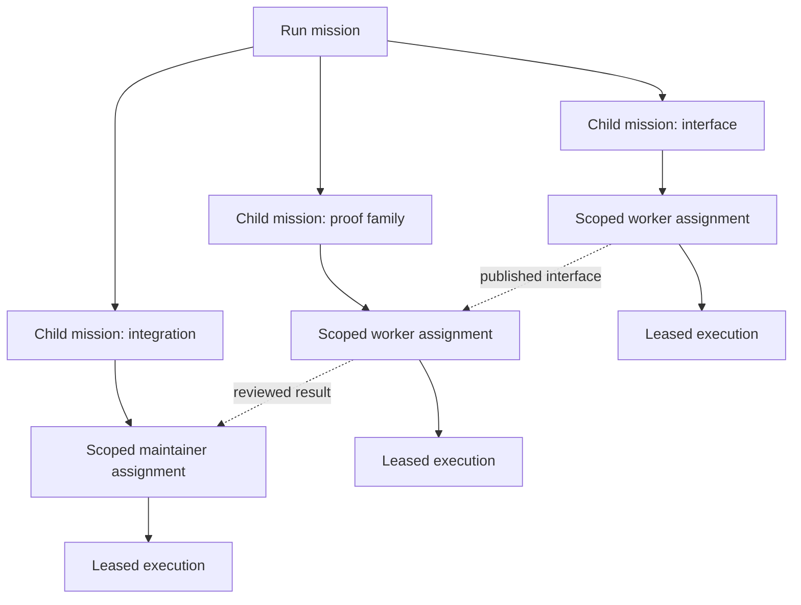

# Mission Coordination

This guide describes the current mission contract and agent workflow. The typed
API schema is authoritative for request fields. Design audits describe proposals
and historical findings; they are not an alternative dispatch procedure.

## Ownership And Dependencies

The mission tree is the source of mathematical intent and delegated scope. A run
pursues a root mission under a phase and resource limits. Assignments give scoped
work and an obligation ledger to a worker or maintainer. Executions are leased
attempts on those assignments; retrying an attempt does not invent a new mission.

Keep three relationships separate:

| Relationship | Meaning |
| --- | --- |
| Mission `parent_id` | This narrower outcome contributes to its parent's outcome |
| Assignment `parent_id` | This assignment was delegated by that assignment |
| Mathematical dependency or assignment start condition | This work requires particular evidence or another transition |

A mission may depend on evidence produced in another branch of the tree. Moving
it under that producer would confuse dependency with responsibility. Put real
mathematical prerequisites in the graph and execution waits in typed start
conditions. Every wait needs a producer that can run independently.

The solid hierarchy records responsibility. Dotted edges represent required
evidence, not a second parent or another queue.

## A Delegation Contract

Create a child only when a distinct, independently checkable result benefits from
its own context. A useful contract contains:

| Field | Purpose |
| --- | --- |
| `objective` | The concrete outcome, including relevant constraints |
| `acceptance_criteria` | Observable evidence needed to consider the outcome fulfilled |
| `delegation_note` | Why this child advances the parent and who integrates the result |
| `scope` | Allowed node IDs, document IDs and repository paths for further delegation |
| `max_open_children` | Maximum simultaneously open direct children; defaults to 8 |

`scope` contains `node_ids`, `document_ids`, and `repository_paths`. Each repository
entry has `repository_id` and a relative `path`; a null path selects the whole
repository. A child inherits the parent scope when omitted. A supplied scope must
fit within its parent. Scope is a delegation contract, not a replacement for
repository permissions or the host's filesystem sandbox.

The server can check project identity, structural scope containment, tree cycles,
revisions, lifecycle and child counts. It cannot establish that prose describes
a useful mathematical decomposition. The delegator must still explain why the
child is narrower and preserve ownership of shared interfaces and integration.
Do not hand the whole unchanged mission to one successor to escape a difficult
context. A native child is suitable for a short independent investigation; a
durable assignment is suitable when the work should survive its parent process.

## Agent Decision Loop

1. Use the supplied assignment and phase outcome. Read `agent context` for
   omitted or changed mission records, obligations and relevant notices.
2. Inspect the evidence and choose a bounded next result. Reuse an existing owner
   before creating new work. Record the reason when a dependency prevents progress.
3. Work locally, use a native specialist, or create a narrower child mission and
   assignment. Give the child exact source revisions, allowed changes, expected
   evidence and an integration owner.
4. Publish useful work and verify delivery receipts. Reviewers assess the exact
   PR head; a maintainer records the acceptance decision under destination policy.
5. Finish the bounded assignment after accounting for its obligations. Hand real
   findings to an identified repair owner. Complete a mission only when its own
   acceptance criteria and required children are settled.

The same loop applies to preprocessing contracts, formalization proof families
and postprocessing ports. Phase-specific gates still decide what counts as
accepted evidence. A published PR completes an assignment whose deliverable is a
PR; it does not assert that the parent mission or mathematical proof is complete.

## Transactional Changes

Use the journaled agent client and its idempotency key for each intended mutation.
After a lost reply, reconcile that request before submitting a replacement.
Read the operation schema rather than constructing fields from a prose example.

Creating a child uses `POST /api/v3/records/mission` with `parent_id` and
`expected_parent_revision`. The parent revision changes as child membership
changes, preventing simultaneous delegators from overcommitting its child budget.
Child missions require acceptance criteria and a delegation note. Updating or
moving a mission uses `PATCH /api/v3/missions/{id}` with `expected_revision`;
moving under another parent also supplies its `expected_parent_revision`.
Agent mutations stay within the current assignment's mission subtree and same-run
queue scope. A move cannot form a cycle, escape that scope or place a child under
a closed parent. Worker sessions may create worker work; creating a maintainer
assignment remains a maintainer-authorized or scheduler-internal responsibility
because it grants review authority. A worker can record the need for review and
hand it to that owner.

Queue order uses the `move_before` and `move_after` commands on pending
assignments. A move changes the next eligible start; it does not override a
dependency, reserve a slot or interrupt another execution. Cancelling obsolete
work preserves its evidence and unfinished obligations. Reconcile the owner and
replacement before removing an item from active work; never delete history or
mark missing evidence complete merely to shorten the queue.

Mission completion is an explicit semantic decision through `complete_mission`.
It is rejected while any descendant mission remains open. The default root
maintainer retains phase closure while parallel work belongs in explicit child
missions. No automation child is exempt from this invariant. Terminal
mission contracts cannot be silently edited. `cancel_mission` is the explicit
terminal operation for abandoned scope; it requires no open descendants or
pending/running/stopping assignments and preserves the mission and its evidence.
Reopening is a revisioned decision whose parent must be open. Finishing an
assignment, resolving a ledger item by delegation or observing a successful
execution is not mission completion.

## Repair Ownership

For each substantive review finding, retain the inspected head, finding evidence,
requested change, owner and next check. A maintainer may make a bounded repair
directly. Larger fixes need one scoped durable owner with a concrete deliverable;
the maintainer can finish the pass or checkpoint its concrete integration task
on the repair owner's terminal event, releasing execution capacity.

Do not schedule another review of an unchanged head to obtain a different vote.
Review ownership is idempotent on `(forge_item, head_oid, descriptor_revision,
policy_revision, target_branch)`. Reconcile an existing owner before preparing
another invocation. A changed head requires current-head coverage; explicitly
justified carry-forward is distinct from a new specialist review. A failed review
may be retried only with `retry_of` and a concrete `retry_note` explaining the
diagnosed failure and repair. Attempt counts remain diagnostic; there is no
lifetime attempt cap requiring an unrelated head or policy change after an
infrastructure repair. Each retry is an explicit decision, subject to existing
capacity and provider cooldown checks. Active, uncertain or fenced owners must
be reconciled rather than duplicated. A completed review with an unusable report
may use the explicit diagnosed reporting-recovery path; a valid approval or
substantive changes request cannot be retried just to obtain another verdict.
Delivery failures remain visible for reconciliation and do not supply acceptance
evidence.

When a repair fails, retain its artifacts and diagnose its outcome before
retrying. Revise the existing owner or create a justified replacement with a link
to the failed attempt. A failure is not permission for an endless chain of fresh
assignments. Conditions must not make authors wait on reviewers who themselves
wait on those authors.

## Shared Health And Capacity

Use `agent context --view operations` for a concrete coordination question. It
reports owners, latest activity, admission blockers, review readiness and safe
run-host health, with links to dashboard activity and scoped records. Other runs
contribute aggregate capacity pressure. The snapshot is an observation, not a
reservation. Another session can claim capacity before delegation is admitted.
Ordinary workers do not need to inspect global activity before every task.

Choose the next action from the observed bottleneck. Unreviewed deliverables need
maintainer attention; ready accepted work needs workers; current-head objections
need repairs; unavailable capacity or services need a recorded waiting reason.
Adding sessions does not repair missing ownership or unblock invalid conditions.
Keep a small ready frontier and reconsider it as evidence changes. A new default
run has one root maintainer entrypoint, not separate planning and supervision
loops. Update an existing recurrence through `defer_automation`, which updates
its pending occurrence with the rule. A concrete external wait can checkpoint
the existing assignment instead of creating another owner.

For unexpected behavior, a parent can invoke the native `orchestration-auditor`
descriptor with the symptom and affected records. The child returns diagnosis,
proposed repair and a success condition; the parent decides and applies authorized
changes. This is an on-demand investigation, not a standing session. Read-only
instructions do not create a separate authorization boundary for native children.

The scheduler owns capacity claims, bounded candidate scanning and bounded
maintenance refill across shared runs. Each recurring automation has at most one
outstanding occurrence; historical duplicate rows are retained and reported for
reconciliation. Explicit child missions and manually authorized assignments may
parallelize disjoint work, subject to the global live-maintainer half-slot budget.
Pending rows are obligations and do not reserve physical slots; live executions
do. Agents can prioritize permitted work and adjust its conditions, but cannot
manufacture resources or bypass run budgets.
Installation operators own budget increases and deployment recovery.

## Operational Boundary

Schema changes require the explicit `migrate` command. Existing mission history
is preserved; migration does not retroactively certify old delegation contracts,
accept PRs or cancel a historical backlog. Source documentation and skills do not
rewrite a running session's pinned bundle. Deploy the tested runtime, migrate the
database and deliberately select updated instructions before expecting the new
workflow in a run. Use isolated test data for validation and the documented
operator commands to reconcile live state.
